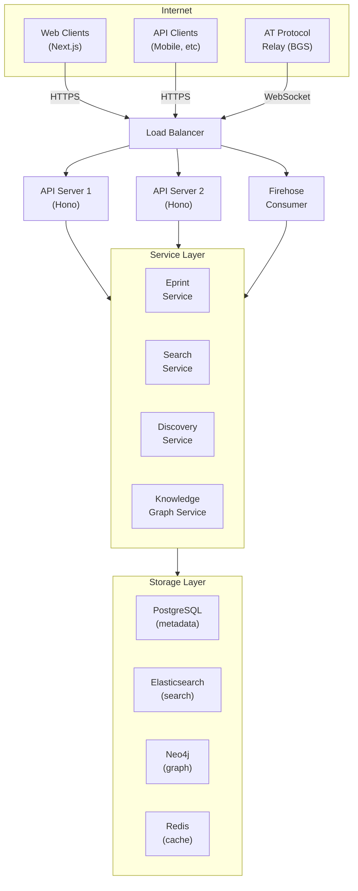
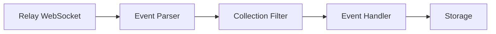
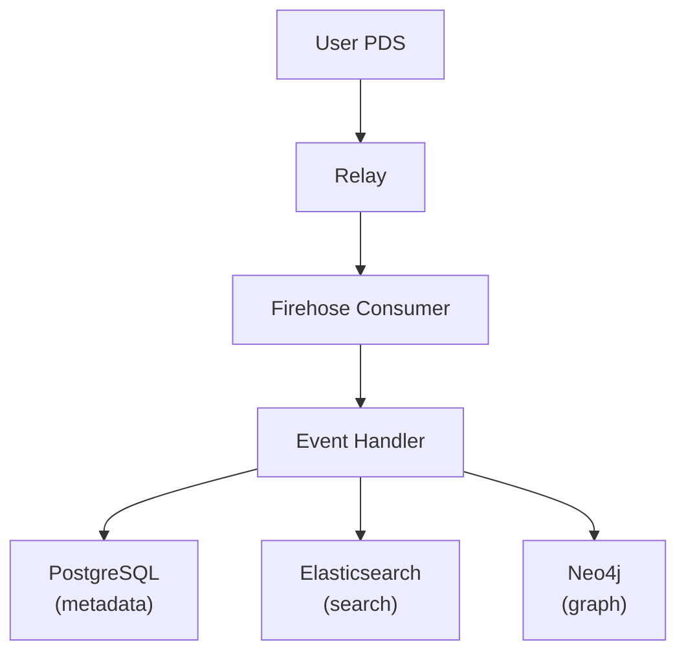
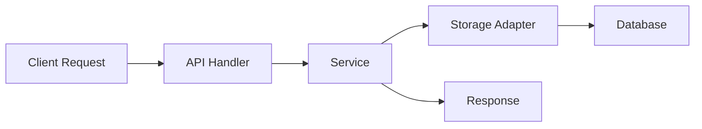
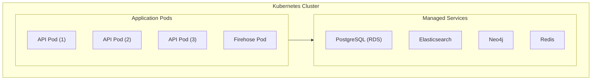
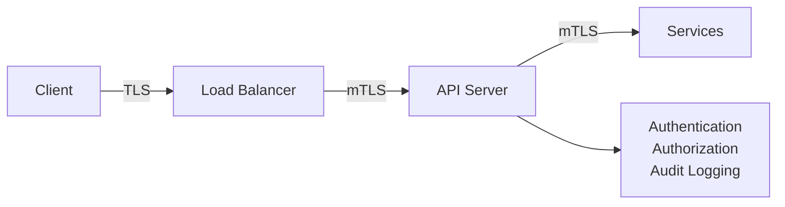
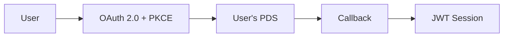
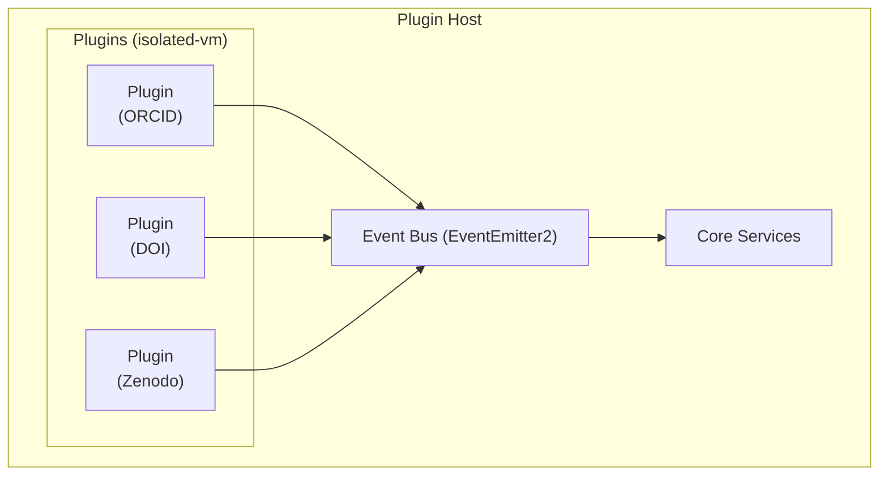
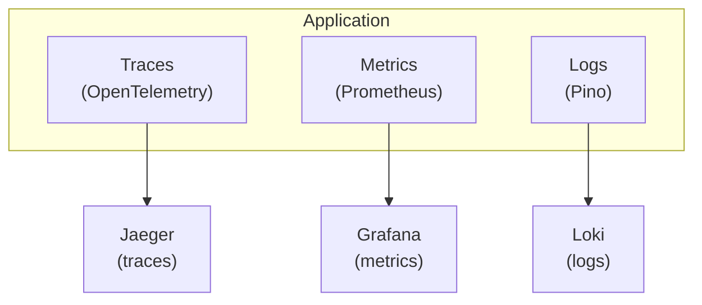

# Architecture

Chive is an AT Protocol AppView that indexes and presents scholarly eprints from the decentralized network. This document provides a high-level overview of the system architecture.

## System overview

## Core components

### API layer

The API layer handles all incoming requests through Hono:

| Component      | Purpose                                            |
| -------------- | -------------------------------------------------- |
| XRPC handlers  | AT Protocol native endpoints (`/xrpc/pub.chive.*`) |
| REST handlers  | Traditional HTTP endpoints (`/api/v1/*`)           |
| Authentication | OAuth 2.0 + PKCE, JWT sessions                     |
| Rate limiting  | Tiered limits by user type                         |
| Validation     | Request/response schema validation                 |

### Firehose consumer

Subscribes to the AT Protocol relay to receive real-time events:

The consumer filters for `pub.chive.*` records and processes:

- Eprint submissions
- Document-level reviews
- Inline annotations and entity links
- Endorsements
- Governance proposals and votes
- User tags

### Service layer

Business logic is encapsulated in services:

| Service               | Responsibility                       |
| --------------------- | ------------------------------------ |
| EprintService         | Eprint CRUD, version management      |
| SearchService         | Full-text search, faceted queries    |
| DiscoveryService      | Recommendations, similar papers      |
| KnowledgeGraphService | Field taxonomy, authority control    |
| ReviewService         | Document-level reviews, endorsements |
| AnnotationService     | Inline annotations, entity links     |
| GovernanceService     | Proposals, voting                    |
| MetricsService        | View counts, trending                |
| ClaimingService       | Authorship verification              |

### Storage layer

Four specialized storage systems:

| System            | Use case                                         |
| ----------------- | ------------------------------------------------ |
| **PostgreSQL**    | Structured metadata, relationships, transactions |
| **Elasticsearch** | Full-text search, faceted filtering              |
| **Neo4j**         | Knowledge graph, citation networks               |
| **Redis**         | Session cache, rate limiting, real-time data     |

## Data flow

### Write path (indexing)

1. User creates a record in their PDS
2. PDS syncs to the relay network
3. Firehose consumer receives the event
4. Event handler validates and routes to appropriate service
5. Service writes to relevant storage systems

### Read path (queries)

1. Client sends request to API
2. Handler authenticates and validates
3. Service orchestrates data retrieval
4. Storage adapter queries appropriate database
5. Response formatted and returned

## Key principles

### AT Protocol compliance

Chive is a read-only indexer. It never:

- Writes to user PDSes
- Stores blob data (only BlobRefs)
- Acts as source of truth for user content

All indexes can be rebuilt from the firehose.

### Horizontal scalability

- API servers scale horizontally
- Single firehose consumer (with failover)
- Managed database services with replication

### Fault tolerance

| Failure              | Recovery                               |
| -------------------- | -------------------------------------- |
| API server crash     | Load balancer routes to healthy nodes  |
| Firehose disconnect  | Automatic reconnect with cursor resume |
| Database unavailable | Circuit breaker, graceful degradation  |
| Cache miss           | Fallback to primary storage            |

## Security architecture

### Zero trust model

- Every request authenticated
- Mutual TLS between internal services
- All actions audit logged
- Secrets managed via HashiCorp Vault

### Authentication flow

## Plugin architecture

Plugins run in isolated-vm sandboxes with:

- Declared permissions
- Resource limits (CPU, memory)
- Controlled API access

## Observability

## Technology choices

| Component     | Technology    | Rationale                          |
| ------------- | ------------- | ---------------------------------- |
| Runtime       | Node.js 22    | V8 performance, AT Protocol SDK    |
| Language      | TypeScript    | Type safety, AT Protocol tooling   |
| API framework | Hono          | Fast, lightweight, Edge-compatible |
| Frontend      | Next.js 15    | React 19, App Router, SSR          |
| Primary DB    | PostgreSQL    | ACID, JSON support, extensions     |
| Search        | Elasticsearch | Full-text, faceted, scalable       |
| Graph DB      | Neo4j         | Citation networks, traversals      |
| Cache         | Redis         | Sessions, rate limiting, pub/sub   |
| Container     | Docker        | Consistent environments            |
| Orchestration | Kubernetes    | Scaling, self-healing              |
| Observability | OpenTelemetry | Vendor-neutral telemetry           |

## Next steps

- [Developer guide](/developer-guide): Implementation details
- [API reference](/api-reference/overview): Endpoint documentation
- [Concepts](/concepts/at-protocol): AT Protocol fundamentals
