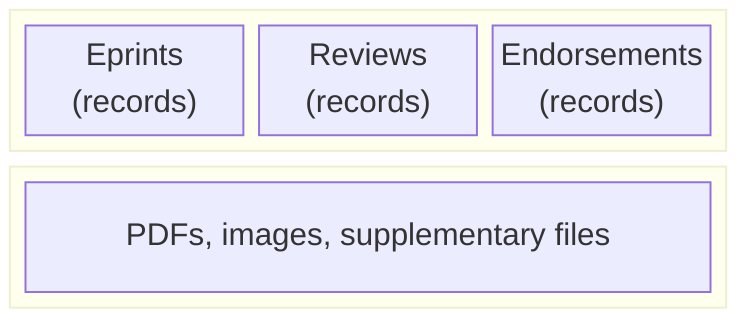
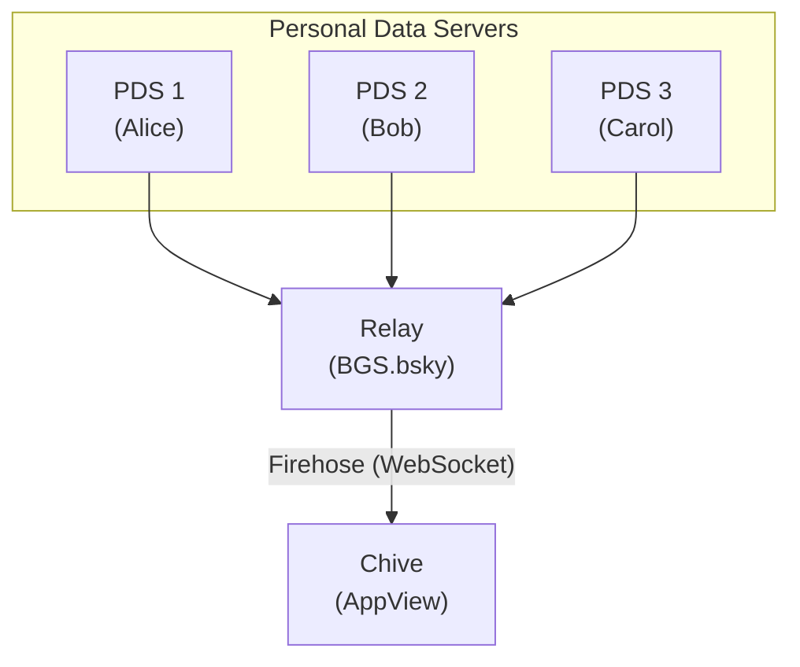
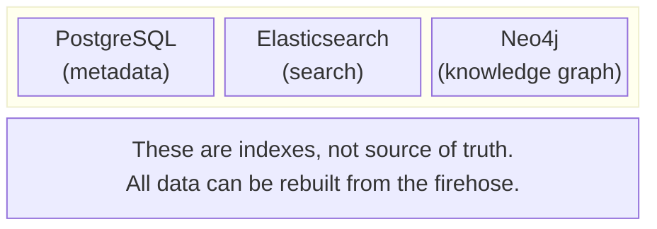

# AT Protocol

The AT Protocol (Authenticated Transfer Protocol) is a decentralized social networking protocol that powers Bluesky and Chive. Understanding its core concepts helps you grasp how Chive stores and retrieves data.

## Core concepts

### Decentralized identifiers (DIDs)

Every user in the AT Protocol ecosystem has a unique identifier called a DID (Decentralized Identifier). Unlike traditional usernames, DIDs are:

- **Persistent**: They never change, even if you switch servers
- **Self-sovereign**: You control your identity, not a platform
- **Cryptographically verifiable**: Ownership can be proven without a central authority

Chive uses two DID methods:

```
did:plc:abc123xyz789...   # PLC (Public Ledger of Credentials)
did:web:example.com       # Web-based, tied to a domain
```

**PLC DIDs** are the most common. They're registered on a public ledger and can be resolved to find your current PDS location.

**Web DIDs** tie your identity to a domain you control. If you own `example.com`, you can use `did:web:example.com` as your identity.

### Personal Data Servers (PDSes)

A PDS stores your data and serves it to applications. Think of it as your personal cloud storage for AT Protocol data.



Key properties of PDSes:

- **Data portability**: Move your PDS to another provider and keep all your data
- **Multi-app access**: Bluesky, Chive, and other AT Protocol apps can all access your PDS
- **User control**: You decide who hosts your data

### Repositories and records

Your PDS contains a **repository**, a collection of signed records organized by type.

```typescript
// Example: An eprint submission record
{
  "$type": "pub.chive.eprint.submission",
  "title": "Novel Approach to Quantum Computing",
  "abstract": "We present a new method...",
  "authors": [
    { "did": "did:plc:abc123...", "name": "Alice Smith" }
  ],
  "pdfBlob": {
    "$type": "blob",
    "ref": { "$link": "bafyreib..." },
    "mimeType": "application/pdf",
    "size": 1234567
  },
  "createdAt": "2025-01-15T10:30:00Z"
}
```

Each record has:

- A **type** (e.g., `pub.chive.eprint.submission`)
- A **record key** (unique identifier within the collection)
- **Content** (the actual data)
- A **signature** (proves authenticity)

### AT URIs

Records are addressed using AT URIs:

```
at://did:plc:abc123.../pub.chive.eprint.submission/3k5...
     └─────────┬────┘  └───────────┬──────────────┘   └┬┘
           DID              Collection             Record Key
```

This URI uniquely identifies a specific eprint by a specific author.

### Lexicons

Lexicons define the schema for record types. They're similar to OpenAPI specifications but designed for AT Protocol.

Chive uses the `pub.chive.*` namespace for all its record types:

| Lexicon                        | Purpose                      |
| ------------------------------ | ---------------------------- |
| `pub.chive.eprint.submission`  | Core eprint metadata         |
| `pub.chive.eprint.version`     | Version tracking             |
| `pub.chive.review.comment`     | Peer review comments         |
| `pub.chive.review.endorsement` | Formal endorsements          |
| `pub.chive.graph.nodeProposal` | Knowledge graph node changes |
| `pub.chive.graph.edgeProposal` | Knowledge graph edge changes |
| `pub.chive.graph.vote`         | Community governance votes   |

### Blobs

Large binary data (PDFs, images) are stored as **blobs**. Records reference blobs using `BlobRef` objects:

```typescript
// BlobRef - a pointer to blob data
{
  "$type": "blob",
  "ref": {
    "$link": "bafyreib..."  // CID (Content Identifier)
  },
  "mimeType": "application/pdf",
  "size": 1234567
}
```

The CID (Content Identifier) is a cryptographic hash of the blob content. This ensures:

- **Integrity**: Any change to the file produces a different CID
- **Deduplication**: Identical files share the same CID
- **Verification**: You can verify you received the correct file

## The firehose

The firehose is a real-time stream of all repository events across the network. It's how AppViews like Chive discover new content.



The firehose delivers events in near real-time:

```typescript
// Example firehose event
{
  "repo": "did:plc:abc123...",
  "commit": {
    "rev": "3k5...",
    "operation": "create",
    "collection": "pub.chive.eprint.submission",
    "rkey": "abc123",
    "record": { /* eprint data */ }
  }
}
```

## AppViews

An AppView is a read-only service that indexes data from the firehose and presents it to users. Chive is an AppView.

**AppViews never modify user data.** They only:

1. Subscribe to the firehose
2. Index relevant records
3. Serve queries and views

If Chive's database is deleted, no user data is lost - everything remains in user PDSes.



### AppView responsibilities

| What AppViews do           | What AppViews never do             |
| -------------------------- | ---------------------------------- |
| Index records              | Write to user PDSes                |
| Serve search queries       | Store user data as source of truth |
| Cache blob references      | Store blob data directly           |
| Track record relationships | Modify or delete user records      |

## Practical implications for Chive users

### Your data is portable

Since your eprints live in your PDS, you can:

- Switch PDS providers without losing work
- Use your eprints in other AT Protocol apps
- Export everything at any time

### No platform lock-in

If Chive shuts down tomorrow:

- Your eprints remain in your PDS
- Another AppView could index them
- Your DOIs, ORCIDs, and citations stay valid

### Identity is permanent

Your DID stays the same even if:

- You change your handle
- You switch PDS providers
- You stop using Chive

### Content is cryptographically signed

Every record you create is signed with your private key. This means:

- No one can forge your eprints
- Modifications are detectable
- Authorship is provable

## Terminology reference

| Term            | Definition                                                |
| --------------- | --------------------------------------------------------- |
| **AT Protocol** | Authenticated Transfer Protocol, the underlying protocol  |
| **DID**         | Decentralized Identifier, your permanent identity         |
| **PDS**         | Personal Data Server, where your data lives               |
| **Repository**  | Your collection of signed records in a PDS                |
| **Record**      | A single data object (eprint, review, etc.)               |
| **Lexicon**     | Schema definition for record types                        |
| **Blob**        | Binary large object (PDFs, images)                        |
| **BlobRef**     | A pointer to a blob, containing its CID                   |
| **CID**         | Content Identifier, a cryptographic hash of content       |
| **Firehose**    | Real-time stream of all network events                    |
| **Relay**       | Service that aggregates and redistributes firehose events |
| **AppView**     | Read-only service that indexes and presents data          |

## Next steps

- [Data sovereignty](./data-sovereignty.md): How Chive protects your ownership
- [Knowledge graph](./knowledge-graph.md): Community-curated classification
- [Quick start](/getting-started/quick-start): Submit your first eprint
