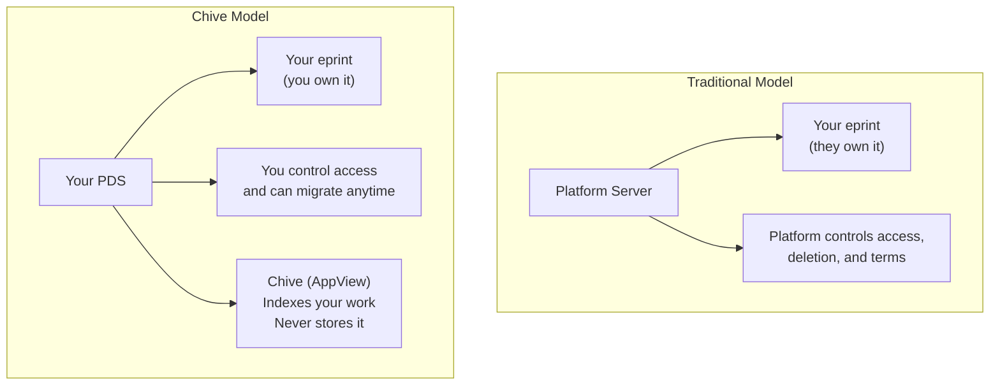
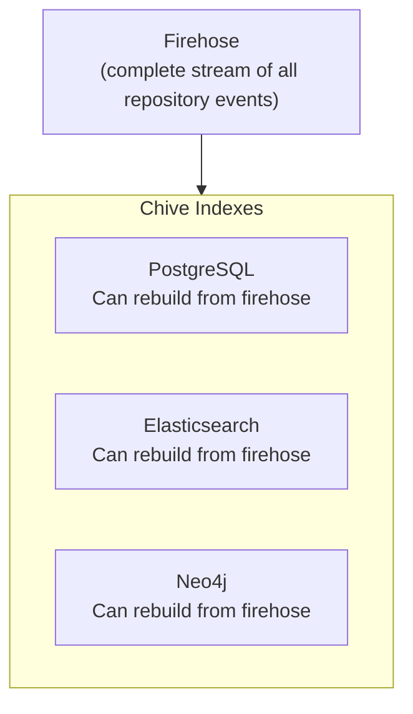
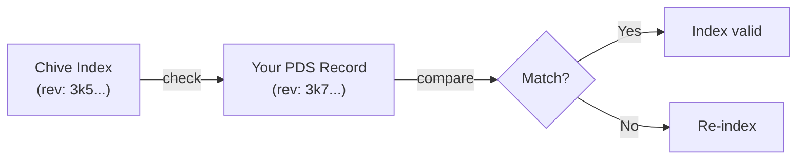
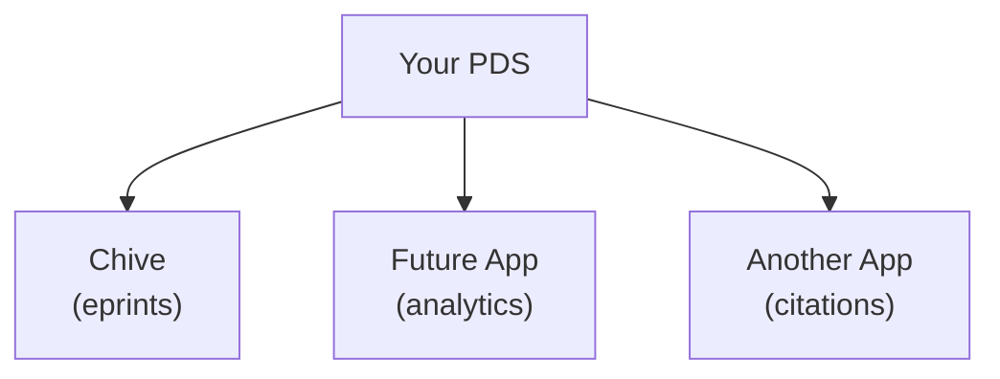

# Data sovereignty

Data sovereignty means you own and control your scholarly work. In Chive, your eprints, reviews, and endorsements belong to you, not the platform.

## The ownership model

Traditional eprint services store your work on their servers. You're a guest in their house. Chive inverts this relationship:



## What Chive stores (and doesn't)

### Chive stores

| Data type         | What Chive keeps                | Purpose              |
| ----------------- | ------------------------------- | -------------------- |
| Metadata indexes  | Title, authors, abstract        | Search and discovery |
| BlobRefs          | Pointers to PDFs (not the PDFs) | Link to your files   |
| Relationship data | Citations, endorsements         | Knowledge graph      |
| Computed metrics  | View counts, trending scores    | Analytics            |

### Chive never stores

| Data type               | Why not                      |
| ----------------------- | ---------------------------- |
| Your PDFs               | Those live in your PDS       |
| Your private keys       | You control your identity    |
| Source-of-truth records | Your PDS is authoritative    |
| Blob data               | Only BlobRefs (CID pointers) |

## BlobRefs, not blobs

When you upload a PDF to Chive, it goes to your PDS, not to Chive's servers. Chive only stores a **BlobRef**, a pointer containing:

```typescript
{
  "$type": "blob",
  "ref": {
    "$link": "bafyreibvocy34..."  // CID (content hash)
  },
  "mimeType": "application/pdf",
  "size": 2847593
}
```

When someone views your eprint, Chive fetches the PDF from your PDS using the BlobRef. The CID (Content Identifier) ensures the file hasn't been tampered with.

### Benefits of BlobRefs

| Benefit           | Explanation                         |
| ----------------- | ----------------------------------- |
| **Integrity**     | CID changes if file is modified     |
| **Deduplication** | Identical files share the same CID  |
| **Portability**   | Move your PDS; BlobRefs still work  |
| **Verification**  | Anyone can verify file authenticity |

## Rebuildable indexes

Every index in Chive can be rebuilt from the AT Protocol firehose. This design principle ensures:

1. **No data loss**: If Chive's database is wiped, user data remains safe in PDSes
2. **No lock-in**: Another AppView could index the same data
3. **Auditability**: The firehose provides a complete event history



### Rebuild process

If Chive needs to rebuild its indexes:

1. Connect to the relay's firehose
2. Replay all `pub.chive.*` events from the beginning
3. Rebuild PostgreSQL, Elasticsearch, and Neo4j indexes
4. Verify consistency with live PDS data

No user action required. No data migration. No export/import.

## PDS staleness detection

Since your PDS is the source of truth, Chive periodically checks for staleness:



Staleness detection catches:

- Missed firehose events
- PDS migrations
- Network partitions
- Record updates outside the firehose window

## Portability guarantees

### Switching PDS providers

Your DID remains constant. When you migrate to a new PDS:

1. Export your repository from the old PDS
2. Import to the new PDS
3. Update your DID document to point to the new PDS
4. Chive detects the change and re-indexes

Your eprints, reviews, and endorsements move with you. No broken links. No lost citations.

### Using multiple AppViews

Your data is accessible to any compliant AppView:



Each AppView provides a different lens on your data. You don't need to re-upload anything.

### Exporting your data

At any time, you can export your complete repository:

```bash
# Export from your PDS (hypothetical command)
atproto repo export did:plc:abc123... --output my-research.car
```

The export contains:

- All your records (eprints, reviews, endorsements)
- Cryptographic signatures proving authenticity
- Complete revision history
- BlobRefs (pointers to your files)

## Cryptographic guarantees

### Signed records

Every record you create is cryptographically signed:

```typescript
{
  "record": {
    "$type": "pub.chive.eprint.submission",
    "title": "My Research",
    // ... content
  },
  "sig": "zQmY8GkP..."  // Your signature
}
```

This signature proves:

- **Authenticity**: You created this record
- **Integrity**: The content hasn't changed
- **Non-repudiation**: You can't deny creating it

### Content addressing

Blobs (PDFs, images) use content-addressed storage:

```
PDF content → SHA-256 hash → CID: bafyreibvocy34...
```

If even one byte changes, the CID changes. This makes tampering detectable.

## What if Chive disappears?

If Chive shuts down:

| What happens               | What doesn't happen           |
| -------------------------- | ----------------------------- |
| Chive's indexes go offline | Your eprints are deleted      |
| Search becomes unavailable | Your PDFs become inaccessible |
| Discovery features stop    | Your DOIs break               |
|                            | Your citations vanish         |

Your work remains in your PDS. Another AppView could index it. Your DOIs (registered with external services) continue to resolve.

## Comparison with traditional platforms

| Feature               | Traditional eprint service | Chive                 |
| --------------------- | -------------------------- | --------------------- |
| Data location         | Platform servers           | Your PDS              |
| Ownership             | Platform owns copy         | You own original      |
| Portability           | Export/import required     | Automatic via DID     |
| Backup responsibility | Platform                   | You (or PDS provider) |
| Platform shutdown     | Data at risk               | Data unaffected       |
| Terms of service      | Can restrict access        | You set terms         |
| API access            | Platform controls          | Open AT Protocol      |

## Your responsibilities

Data sovereignty comes with responsibility:

| Responsibility         | How to handle it                                          |
| ---------------------- | --------------------------------------------------------- |
| **PDS reliability**    | Choose a reputable PDS provider or self-host              |
| **Backup**             | Most PDS providers handle backups; verify their policies  |
| **Key management**     | Secure your private keys; recovery is your responsibility |
| **Content moderation** | You're responsible for what you publish                   |

## Next steps

- [AT Protocol](./at-protocol.md): Technical foundations
- [Knowledge graph](./knowledge-graph.md): Community classification
- [Submitting eprints](/user-guide/submitting-eprints): Get started
