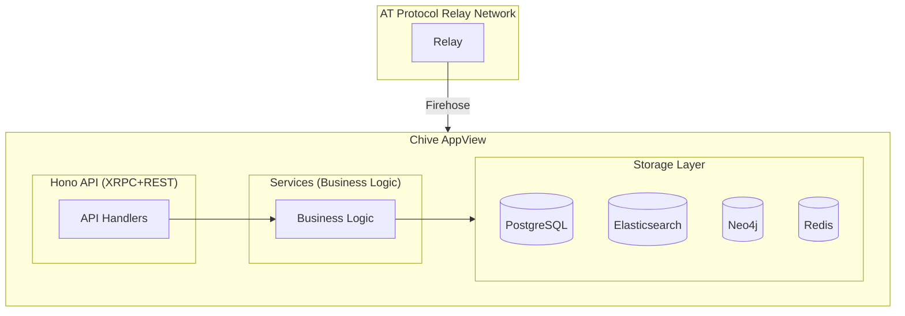

# Developer guide

This guide covers the technical architecture and implementation details of Chive. It's intended for developers who want to contribute to the project or understand how the system works.

## Architecture overview

Chive is an AT Protocol AppView that indexes scholarly eprints from the decentralized network. The system consists of:



## Key principles

### AT Protocol compliance

Chive is a read-only indexer. All user content lives in Personal Data Servers (PDSes). The golden rules:

- Read from the firehose, never write to user PDSes
- Store BlobRefs (CID pointers), never blob data
- All indexes must be rebuildable from the firehose
- Track PDS source for staleness detection

### Modular architecture

Services use dependency injection via TSyringe. All major components implement interfaces with `I*` prefix:

```typescript
interface ISearchEngine {
  indexEprint(doc: IndexableEprintDocument): Promise<void>;
  search(query: SearchQuery): Promise<SearchResults>;
}
```

### Plugin system

Plugins extend functionality through a hybrid DI + EventEmitter2 architecture. Plugins run in isolated-vm sandboxes with declared permissions.

## Guide sections

| Section                                                     | Description                               |
| ----------------------------------------------------------- | ----------------------------------------- |
| [API layer](./api-layer.md)                                 | XRPC and REST endpoint implementation     |
| [Authentication](./authentication-authorization.md)         | OAuth, sessions, and authorization        |
| [Core services](./core-business-services.md)                | Business logic services                   |
| [Lexicon type validation](./lexicon-type-validation.md)     | Generated types and runtime validation    |
| [Frontend](./frontend.md)                                   | Next.js architecture and components       |
| [Frontend rich text](./frontend-rich-text.md)               | Rich text rendering and schema migrations |
| [Frontend eprint lifecycle](./frontend-eprint-lifecycle.md) | Edit, version, and delete components      |
| [Plugin system](./plugin-system.md)                         | Creating and managing plugins             |
| [Advanced features](./advanced-features.md)                 | Knowledge graph, discovery, and more      |
| [Observability](./observability-monitoring.md)              | Logging, metrics, and tracing             |

### Subdirectories

| Directory                | Description                             |
| ------------------------ | --------------------------------------- |
| [plugins/](./plugins/)   | Plugin development guides and reference |
| [services/](./services/) | Individual service documentation        |
| [storage/](./storage/)   | Database adapter documentation          |

## Technology stack

| Layer            | Technology           |
| ---------------- | -------------------- |
| Runtime          | Node.js 22+          |
| Language         | TypeScript 5.5+      |
| API              | Hono (XRPC + REST)   |
| Frontend         | Next.js 15, React 19 |
| Primary database | PostgreSQL 16+       |
| Search           | Elasticsearch 8+     |
| Graph database   | Neo4j 5+             |
| Cache            | Redis 7+             |
| Testing          | Vitest, Playwright   |

## Development setup

```bash
# Clone and install
git clone https://github.com/chive-pub/chive.git
cd chive
pnpm install

# Start infrastructure
./scripts/start-test-stack.sh

# Run development server
pnpm dev

# Run tests
pnpm test
```

## Directory structure

```
src/
├── api/           # Hono XRPC + REST handlers
├── atproto/       # AT Protocol client, firehose consumer
├── auth/          # Authentication and authorization
├── config/        # Configuration loading
├── jobs/          # Background job definitions
├── lexicons/      # Generated lexicon types
├── observability/ # Logging, metrics, tracing
├── plugins/       # Plugin system and builtins
├── services/      # Business logic services
├── storage/       # Database adapters
├── types/         # TypeScript type definitions
├── utils/         # Utility functions
└── workers/       # Worker threads
```

## Next steps

Start with [API layer](./api-layer.md) to understand how requests are handled, then explore [Core services](./core-business-services.md) for the business logic.
