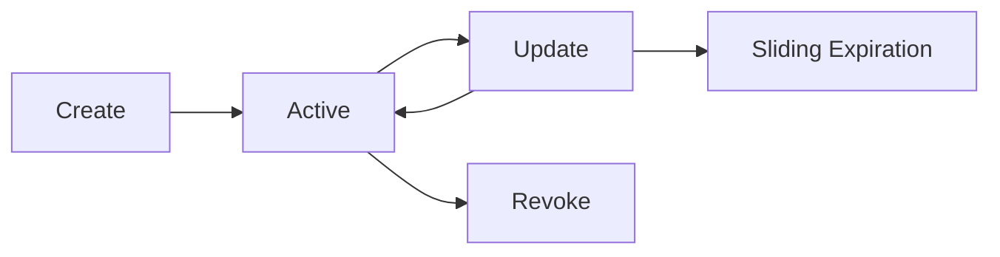
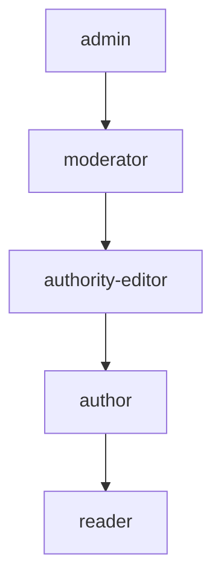

# Authentication and authorization

## Overview

Chive's authentication and authorization system is built on ATProto's DID-based identity model. The system provides:

1. **DID-based authentication**: Identity verification via AT Protocol DIDs
2. **JWT session management**: Stateless access tokens with Redis-backed sessions
3. **RBAC authorization**: Role-based access control via Casbin
4. **OAuth 2.0 + PKCE**: Secure third-party application authorization
5. **Multi-factor authentication**: TOTP and backup codes
6. **WebAuthn/Passkeys**: Passwordless authentication
7. **Zero-trust architecture**: NIST SP 800-207 compliant security model

---

## Architecture

### Directory structure

```text
src/auth/
├── index.ts                       # Barrel exports
├── errors.ts                      # Auth-specific error types
├── authentication-service.ts      # Main authentication orchestration
├── did/
│   ├── did-resolver.ts            # DID document resolution
│   ├── did-verifier.ts            # Signature verification
│   └── index.ts
├── jwt/
│   ├── jwt-service.ts             # Token issuance/verification
│   ├── key-manager.ts             # ES256 key management
│   └── index.ts
├── session/
│   ├── session-manager.ts         # Redis session store
│   └── index.ts
├── authorization/
│   ├── authorization-service.ts   # Casbin RBAC
│   ├── policies/
│   │   └── model.conf             # Casbin model
│   └── index.ts
├── oauth/
│   ├── oauth-service.ts           # OAuth 2.0 flows
│   ├── pkce.ts                    # PKCE utilities
│   └── index.ts
├── webauthn/
│   ├── webauthn-service.ts        # Passkey operations
│   └── index.ts
├── mfa/
│   ├── mfa-service.ts             # MFA orchestration
│   └── index.ts
└── zero-trust/
    ├── zero-trust-service.ts      # Trust evaluation
    └── index.ts
```

---

## Quick start

### Authenticating users

```typescript
import { AuthenticationService } from '@/auth/authentication-service.js';
import { DIDResolver } from '@/auth/did/did-resolver.js';
import { JWTService } from '@/auth/jwt/jwt-service.js';
import { SessionManager } from '@/auth/session/session-manager.js';

// Create services
const didResolver = new DIDResolver({ redis, logger });
const jwtService = new JWTService({ keyManager, redis, logger });
const sessionManager = new SessionManager({ redis, logger });

const authService = new AuthenticationService({
  didResolver,
  jwtService,
  sessionManager,
  logger,
});

// Authenticate with DID
const result = await authService.authenticate({
  did: 'did:plc:abc123',
  credential: {
    type: 'app_password',
    value: 'xxxx-xxxx-xxxx-xxxx',
  },
  metadata: {
    ipAddress: '192.168.1.1',
    userAgent: 'Mozilla/5.0...',
  },
});

// Result includes session and tokens
console.log(result.session.id);
console.log(result.accessToken);
console.log(result.refreshToken);
```

### Protecting routes

```typescript
import { authenticate, requirePermission } from '@/api/middleware/auth.js';

const app = new Hono<ChiveEnv>();

// Require authentication
app.use('/api/*', authenticate());

// Require specific permission
app.post('/api/v1/eprints', requirePermission('eprint', 'create'), async (c) => {
  const user = c.get('user');
  // User is authenticated and has eprint:create permission
});
```

---

## DID resolution

Chive resolves ATProto DIDs to retrieve identity documents containing public keys for signature verification.

### Supported DID methods

| Method    | Format                | Resolution              |
| --------- | --------------------- | ----------------------- |
| `did:plc` | `did:plc:abc123...`   | PLC Directory lookup    |
| `did:web` | `did:web:example.com` | HTTPS .well-known fetch |

### Usage

```typescript
import { DIDResolver } from '@/auth/did/did-resolver.js';

const resolver = new DIDResolver({
  redis,
  logger,
  config: {
    plcDirectoryUrl: 'https://plc.directory',
    cacheTtlSeconds: 300, // 5 minutes
  },
});

// Resolve DID document
const didDocument = await resolver.resolve('did:plc:abc123');

// Get verification methods
const verificationMethods = didDocument.verificationMethod;

// Get PDS endpoint
const pdsEndpoint = await resolver.getPDSEndpoint('did:plc:abc123');
```

### Caching

DID documents are cached in Redis with configurable TTL to reduce resolution latency and external API calls.

```text
Key format: chive:did:document:{did}
Default TTL: 300 seconds (5 minutes)
```

---

## JWT service

### Token structure

Chive issues ES256-signed JWTs with the following claims:

| Claim       | Description                        |
| ----------- | ---------------------------------- |
| `sub`       | User DID                           |
| `iss`       | Token issuer (https://chive.pub)   |
| `aud`       | Token audience (https://chive.pub) |
| `iat`       | Issued at timestamp                |
| `exp`       | Expiration timestamp               |
| `jti`       | Unique token ID                    |
| `sessionId` | Associated session ID              |
| `scope`     | Space-separated scopes             |

### Issuing tokens

```typescript
import { JWTService } from '@/auth/jwt/jwt-service.js';
import { KeyManager } from '@/auth/jwt/key-manager.js';

const keyManager = new KeyManager({ redis, logger });
const jwtService = new JWTService({
  keyManager,
  redis,
  logger,
  config: {
    issuer: 'https://chive.pub',
    audience: 'https://chive.pub',
    accessTokenExpirationSeconds: 3600, // 1 hour
  },
});

const { token, jti, expiresAt } = await jwtService.issueToken({
  subject: 'did:plc:abc123',
  sessionId: 'sess_xyz',
  scopes: ['read:eprints', 'write:reviews'],
});
```

### Verifying tokens

```typescript
try {
  const { claims } = await jwtService.verifyToken(token);
  console.log(claims.sub); // did:plc:abc123
  console.log(claims.sessionId); // sess_xyz
  console.log(claims.scope); // 'read:eprints write:reviews'
} catch (error) {
  if (error instanceof TokenExpiredError) {
    // Token has expired
  } else if (error instanceof TokenValidationError) {
    // Token is invalid
  }
}
```

### Token revocation

```typescript
// Revoke a specific token
await jwtService.revokeToken(jti, expiresAt);

// Token is now blacklisted until expiration
await jwtService.verifyToken(token); // Throws TokenRevokedError
```

### Key rotation

Keys are automatically rotated based on configuration:

```typescript
const keyManager = new KeyManager({
  redis,
  logger,
  config: {
    rotationIntervalSeconds: 7776000, // 90 days
    overlapPeriodSeconds: 86400, // 24 hours
  },
});
```

During the overlap period, both old and new keys are valid for verification, so tokens signed with the previous key continue to work until the overlap expires.

---

## Session management

### Session lifecycle



### Creating sessions

```typescript
import { SessionManager } from '@/auth/session/session-manager.js';

const sessionManager = new SessionManager({
  redis,
  logger,
  config: {
    sessionExpirationSeconds: 2592000, // 30 days
    maxSessionsPerUser: 10,
  },
});

const session = await sessionManager.createSession('did:plc:abc123', {
  ipAddress: '192.168.1.1',
  userAgent: 'Mozilla/5.0...',
  deviceId: 'device_xyz',
  scope: ['read:eprints', 'write:reviews'],
});
```

### Session operations

```typescript
// Get session
const session = await sessionManager.getSession(sessionId);

// Update session (sliding expiration)
await sessionManager.updateSession(sessionId, {
  lastActivity: new Date(),
});

// Revoke single session
await sessionManager.revokeSession(sessionId);

// Revoke all sessions (logout everywhere)
await sessionManager.revokeAllSessions('did:plc:abc123');

// List active sessions
const sessions = await sessionManager.listSessions('did:plc:abc123');
```

### Redis storage

```text
Session key:     chive:session:{sessionId}
User index:      chive:user:sessions:{did}
Token blacklist: chive:token:revoked:{jti}
```

---

## Authorization (RBAC)

### Role hierarchy



### Permission model

Permissions follow the format `{resource}:{action}`:

| Resource | Actions                                       |
| -------- | --------------------------------------------- |
| `eprint` | `create`, `read`, `update`, `delete`, `admin` |
| `review` | `create`, `read`, `update`, `delete`          |
| `graph`  | `propose`, `vote`, `approve`, `admin`         |
| `user`   | `read`, `update`, `admin`                     |

### Usage

```typescript
import { AuthorizationService } from '@/auth/authorization/authorization-service.js';

const authzService = new AuthorizationService({ redis, logger });
await authzService.initialize();

// Assign role
await authzService.assignRole('did:plc:abc123', 'author');

// Check authorization
const result = await authzService.authorize({
  subject: { did: 'did:plc:abc123', roles: ['author'] },
  action: 'create',
  resource: { type: 'eprint' },
});

if (result.allowed) {
  // Proceed with action
} else {
  // Access denied: result.reason
}

// Resource owner check
const ownerResult = await authzService.authorize({
  subject: { did: 'did:plc:abc123', roles: ['author'] },
  action: 'update',
  resource: {
    type: 'eprint',
    ownerDid: 'did:plc:abc123', // Same as subject
  },
});
// ownerResult.allowed === true
// ownerResult.reason === 'resource_owner'
```

### Casbin policy model

```ini
[request_definition]
r = sub, obj, act

[policy_definition]
p = sub, obj, act

[role_definition]
g = _, _

[policy_effect]
e = some(where (p.eft == allow))

[matchers]
m = g(r.sub, p.sub) && r.obj == p.obj && r.act == p.act
```

---

## ATProto OAuth

Chive uses the ATProto OAuth specification for authentication, which includes PKCE and DPoP automatically.

### Client setup

```typescript
import { ATProtoOAuthClient } from '@/auth/atproto-oauth/node-oauth-client.js';

const oauthClient = new ATProtoOAuthClient({
  clientMetadata: {
    clientId: 'https://chive.pub/oauth/client-metadata.json',
    redirectUri: 'https://chive.pub/oauth/callback',
    scopes: ['atproto', 'transition:generic'],
  },
  redis,
  logger,
});

await oauthClient.initialize();
```

### Authentication flow

The `@atproto/oauth-client-node` library handles the OAuth flow including:

- PKCE code challenges (S256)
- DPoP token binding
- Pushed Authorization Requests (PAR)
- Session management

```typescript
// 1. Generate authorization URL for a PDS handle
const authUrl = await oauthClient.authorize(handle, {
  scope: 'atproto transition:generic',
});

// 2. User authorizes at their PDS

// 3. Handle callback with authorization code
const session = await oauthClient.callback(callbackParams);

// Session provides authenticated agent for PDS operations
const agent = session.agent;
```

### Session storage

Sessions are persisted in Redis:

- `RedisSessionStore` - Stores authenticated sessions
- `RedisStateStore` - Stores OAuth state parameters during flow

---

## WebAuthn (Passkeys)

:::info Planned
WebAuthn/Passkey support is not yet implemented. The API surface below reflects the planned design.
:::

### Registration flow

```typescript
import { WebAuthnService } from '@/auth/webauthn/webauthn-service.js';

const webauthnService = new WebAuthnService({
  redis,
  logger,
  config: {
    rpId: 'chive.pub',
    rpName: 'Chive',
    origin: 'https://chive.pub',
  },
});

// 1. Generate registration challenge
const challenge = await webauthnService.generateRegistrationChallenge('did:plc:abc123');

// 2. Client creates credential (browser WebAuthn API)

// 3. Verify registration
const credential = await webauthnService.verifyRegistration('did:plc:abc123', {
  challenge,
  credential: clientResponse,
});
```

### Authentication flow

```typescript
// 1. Generate authentication challenge
const challenge = await webauthnService.generateAuthenticationChallenge('did:plc:abc123');

// 2. Client authenticates (browser WebAuthn API)

// 3. Verify authentication
const result = await webauthnService.verifyAuthentication('did:plc:abc123', {
  challenge,
  credential: clientResponse,
});
```

---

## Multi-factor authentication

:::info Planned
MFA support (TOTP and backup codes) is not yet implemented. The API surface below reflects the planned design.
:::

### TOTP enrollment

```typescript
import { MFAService } from '@/auth/mfa/mfa-service.js';

const mfaService = new MFAService({ redis, logger });

// 1. Start enrollment
const { secret, qrCodeUri } = await mfaService.enrollTOTP('did:plc:abc123');

// 2. User scans QR code in authenticator app

// 3. Verify enrollment with code
await mfaService.verifyTOTPEnrollment('did:plc:abc123', '123456');
```

### Verification

```typescript
// Verify TOTP or backup code
const result = await mfaService.verifyMFA('did:plc:abc123', {
  type: 'totp',
  code: '123456',
});

if (!result.success) {
  console.log(result.error); // 'invalid_code' | 'expired_code' | etc.
}
```

### Backup codes

```typescript
// Generate backup codes
const codes = await mfaService.regenerateBackupCodes('did:plc:abc123');
// Returns array of 10 single-use codes

// Verify backup code
const result = await mfaService.verifyMFA('did:plc:abc123', {
  type: 'backup_code',
  code: 'XXXX-XXXX-XXXX',
});
```

---

## Zero-trust architecture

:::info Planned
The zero-trust evaluation service is not yet implemented. The API surface below reflects the planned design.
:::

### Trust evaluation

```typescript
import { ZeroTrustService } from '@/auth/zero-trust/zero-trust-service.js';

const zeroTrustService = new ZeroTrustService({ redis, logger });

const decision = await zeroTrustService.evaluate({
  subject: {
    did: 'did:plc:abc123',
    sessionId: 'sess_xyz',
    authMethod: 'webauthn',
    authTime: new Date(),
    mfaVerified: true,
    roles: ['author'],
  },
  resource: {
    type: 'eprint',
    sensitivity: 'high',
  },
  context: {
    ipAddress: '192.168.1.1',
    userAgent: 'Mozilla/5.0...',
    deviceId: 'device_xyz',
    requestTime: new Date(),
    geoLocation: 'US',
  },
});

if (decision.allow) {
  // Proceed with request
} else {
  // decision.reason explains why access was denied
  // decision.requiredActions lists remediation steps
}
```

### Trust score components

| Component         | Weight | Description                      |
| ----------------- | ------ | -------------------------------- |
| Authentication    | 0.3    | Auth method strength, MFA status |
| Device Posture    | 0.25   | Known device, security state     |
| Behavior Analysis | 0.25   | Anomaly detection, risk signals  |
| Network Context   | 0.2    | IP reputation, geolocation       |

---

## Paper PDS authentication

Eprints can be stored in two ways: in the submitter's personal PDS (traditional model) or in a dedicated paper account PDS (paper-centric model). Edit and delete operations must authenticate against whichever PDS holds the record.

### How it works

1. The frontend checks whether the eprint has a `paperDid` field
2. If `paperDid` is set, the `PaperAuthGate` component prompts the user to authenticate as the paper account before allowing modifications
3. If `paperDid` is not set, the user's normal session is used

### PaperAuthGate component

`PaperAuthGate` (`web/components/eprints/paper-auth-gate.tsx`) wraps edit and delete actions. It uses a render function pattern:

```tsx
import { PaperAuthGate } from '@/components/eprints/paper-auth-gate';

<PaperAuthGate eprint={eprint}>
  {(paperAgent) => <EditButton eprint={eprint} paperAgent={paperAgent} />}
</PaperAuthGate>;
```

For traditional eprints, `paperAgent` is `null` and children render immediately. For paper-centric eprints, the auth prompt appears first.

### Backend authorization

The `updateSubmission` and `deleteSubmission` XRPC handlers validate authorization server-side. Authorization is granted to:

- The original submitter (by DID)
- The paper account (if paper-centric, by `paperDid`)
- Any author whose DID appears in the eprint's authors array

The handlers do not write to the PDS; they validate permissions and return the information the frontend needs to make the actual PDS call.

### Auth error messages

All authentication and authorization errors use a consistent format across the codebase. The error types from `src/auth/errors.ts` produce user-facing messages:

| Error class           | User-facing message pattern                                  |
| --------------------- | ------------------------------------------------------------ |
| `AuthenticationError` | "Authentication required" or "Invalid credentials"           |
| `AuthorizationError`  | "You do not have permission to \{action\} this \{resource\}" |
| `TokenExpiredError`   | "Your session has expired. Please sign in again."            |
| `SessionRevokedError` | "Your session has been revoked."                             |

For paper PDS operations, the auth prompt displays: "This paper is managed by a dedicated paper account. Please authenticate as that account to make changes."

## Error handling

### Error types

```typescript
import {
  AuthenticationError,
  TokenValidationError,
  TokenExpiredError,
  SessionRevokedError,
  MFARequiredError,
  WebAuthnError,
} from '@/auth/errors.js';
```

### Error codes

| Code                  | Description                       |
| --------------------- | --------------------------------- |
| `invalid_credentials` | Credentials verification failed   |
| `invalid_signature`   | JWT signature verification failed |
| `token_expired`       | JWT has expired                   |
| `token_revoked`       | JWT has been revoked              |
| `session_revoked`     | Session has been revoked          |
| `mfa_required`        | MFA verification required         |
| `invalid_code`        | MFA code is invalid               |

---

## Database schema

### PostgreSQL tables

```sql
-- User roles (RBAC)
CREATE TABLE user_roles (
  did TEXT NOT NULL,
  role TEXT NOT NULL,
  assigned_at TIMESTAMPTZ DEFAULT NOW(),
  assigned_by TEXT,
  expires_at TIMESTAMPTZ,
  PRIMARY KEY (did, role)
);

-- OAuth clients
CREATE TABLE oauth_clients (
  client_id TEXT PRIMARY KEY,
  client_secret_hash TEXT,
  client_type TEXT NOT NULL,
  name TEXT NOT NULL,
  redirect_uris TEXT[] NOT NULL,
  scopes TEXT[] NOT NULL,
  owner_did TEXT NOT NULL,
  is_active BOOLEAN DEFAULT true,
  created_at TIMESTAMPTZ DEFAULT NOW()
);

-- WebAuthn credentials
CREATE TABLE webauthn_credentials (
  credential_id TEXT PRIMARY KEY,
  did TEXT NOT NULL,
  public_key TEXT NOT NULL,
  counter BIGINT DEFAULT 0,
  transports TEXT[],
  nickname TEXT,
  created_at TIMESTAMPTZ DEFAULT NOW()
);

-- MFA enrollments
CREATE TABLE mfa_enrollments (
  did TEXT PRIMARY KEY,
  totp_secret_encrypted TEXT,
  totp_enabled BOOLEAN DEFAULT false,
  backup_codes_hash TEXT[],
  created_at TIMESTAMPTZ DEFAULT NOW()
);

-- Audit log
CREATE TABLE audit_log (
  id BIGSERIAL PRIMARY KEY,
  event_type TEXT NOT NULL,
  actor_did TEXT,
  action TEXT NOT NULL,
  result TEXT NOT NULL,
  ip_address INET,
  details JSONB,
  created_at TIMESTAMPTZ DEFAULT NOW()
);
```

---

## Testing

### Unit tests

```bash
# Run auth unit tests
npm run test:unit -- tests/unit/auth/

# Test specific service
npm run test:unit -- tests/unit/auth/jwt-service.test.ts
```

### Integration tests

```bash
# Run auth integration tests
npm run test:integration -- tests/integration/auth/
```

### Test fixtures

```typescript
import { createMockLogger, createMockRedis } from '@tests/fixtures/mocks.js';

const logger = createMockLogger();
const redis = createMockRedis();

const service = new JWTService({ keyManager, redis, logger });
```

---

## Security considerations

### Token security

- Access tokens expire after 1 hour
- Refresh tokens are single-use
- Token revocation is immediate via Redis blacklist
- ES256 algorithm with 256-bit keys

### Session security

- Sessions expire after 30 days of inactivity
- Maximum 10 sessions per user
- IP and user agent tracked for anomaly detection
- Session revocation cascades to all tokens

### MFA security

- TOTP secrets encrypted at rest (AES-256-GCM)
- Backup codes hashed with SHA-256
- Rate limiting on verification attempts
- Lockout after repeated failures

### WebAuthn security

- Credential counter tracking for replay detection
- Attestation verification (none, direct)
- Challenge expiration (5 minutes)

---

## Next steps

- [API layer](./api-layer): middleware integration and route protection
- [Core business services](./core-business-services): service layer using auth context
- [ATProto DID specification](https://atproto.com/specs/did): DID handling reference
