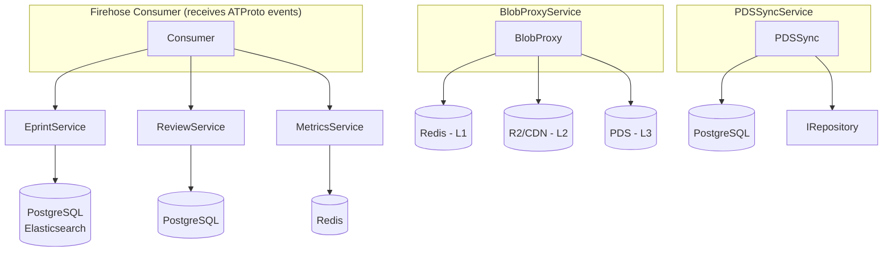

# Core business services

This guide covers the core services that form Chive's business logic layer. These services sit between the firehose indexing pipeline and the storage backends.

## Overview

Chive's core services handle:

- **EprintService**: Indexes eprints from the firehose into PostgreSQL and Elasticsearch
- **BlobProxyService**: Proxies PDF and image blobs from user PDSes with 3-tier caching
- **MetricsService**: Tracks view counts and downloads using Redis data structures
- **PDSSyncService**: Detects stale indexes and triggers re-sync from source PDSes
- **ReviewService**: Indexes reviews and endorsements with threaded discussions

All services follow ATProto compliance rules: they index data from the firehose but never write to user PDSes.

## Architecture

### Service dependencies



### Data flow

1. User creates an eprint record in their PDS
2. PDS publishes event to the ATProto relay
3. Chive's firehose consumer receives the event
4. EprintService indexes the record to PostgreSQL and Elasticsearch
5. MetricsService tracks views when users access the eprint
6. BlobProxyService fetches PDFs from the user's PDS on demand
7. PDSSyncService periodically checks for stale records

## EprintService

Indexes eprints from firehose events into local storage for search and discovery.

### Key methods

```typescript
import { EprintService } from '@/services/eprint/eprint-service.js';

const service = new EprintService({
  storage, // IStorageBackend (PostgreSQL adapter)
  search, // ISearchEngine (Elasticsearch adapter)
  repository, // IRepository (PDS client)
  identity, // IIdentityResolver (DID resolver)
  logger,
});

// Index an eprint from firehose event
await service.indexEprint(eprint, {
  uri: 'at://did:plc:abc/pub.chive.eprint.submission/xyz' as AtUri,
  cid: 'bafyrei...' as CID,
  pdsUrl: 'https://pds.example.com',
  indexedAt: new Date(),
});

// Retrieve by URI
const result = await service.getEprint(uri);

// List by author
const eprints = await service.getEprintsByAuthor(authorDid);

// Handle deletion
await service.indexEprintDelete(uri);
```

### ATProto compliance

EprintService stores BlobRefs (CID pointers), not blob data:

```typescript
// Correct: Store BlobRef metadata
const storedEprint: StoredEprint = {
  uri,
  cid,
  author: record.author,
  title: record.title,
  abstract: record.abstract,
  documentBlobRef: record.document, // CID reference only
  documentFormat: 'pdf',
  pdsUrl: metadata.pdsUrl, // Track source PDS
  indexedAt: new Date(),
};

// Wrong: Never store blob content
// await storage.storeBlob(pdfBuffer); // FORBIDDEN
```

## BlobProxyService

Serves PDFs and images through a 3-tier cache hierarchy.

### Cache tiers

| Tier | Storage       | TTL      | Use case                      |
| ---- | ------------- | -------- | ----------------------------- |
| L1   | Redis         | 1 hour   | Hot blobs, repeated requests  |
| L2   | Cloudflare R2 | 24 hours | Warm blobs, CDN edge delivery |
| L3   | User PDS      | N/A      | Source of truth               |

### RedisCache usage

```typescript
import { RedisCache } from '@/services/blob-proxy/redis-cache.js';

const cache = new RedisCache({
  redis, // ioredis client
  defaultTTL: 3600, // 1 hour
  beta: 1.0, // Probabilistic early expiration factor
  maxBlobSize: 5 * 1024 * 1024, // 5MB limit
  keyPrefix: 'blob:',
  logger,
});

// Cache a blob
await cache.set(cid, buffer, 'application/pdf', 7200);

// Retrieve with early expiration check
const result = await cache.get(cid);
if (result?.isEarlyFetch) {
  // Background refresh before TTL expires
  scheduleRefresh(cid);
}

// Check existence
const exists = await cache.has(cid);

// Remove from cache
await cache.delete(cid);

// Get cache stats
const stats = await cache.getStats();
console.log(`Keys: ${stats.keyCount}, Memory: ${stats.memoryUsage}`);
```

### Probabilistic early expiration

The cache uses XFetch algorithm to prevent cache stampedes. As a cached entry approaches expiration, `isEarlyFetch` returns true with increasing probability, allowing background refresh before the TTL expires.

## MetricsService

Tracks views, downloads, and trending eprints using Redis data structures.

### Data structures

- **Counters** (INCR): Total view and download counts
- **HyperLogLog** (PFADD): Unique viewer estimation
- **Sorted Sets** (ZADD): Time-windowed metrics for trending

### Recording metrics

```typescript
import { MetricsService } from '@/services/metrics/metrics-service.js';

const service = new MetricsService({
  storage,
  redis,
  logger,
  keyPrefix: 'metrics:',
});

// Record a view (with optional viewer DID for unique tracking)
await service.recordView(eprintUri, viewerDid);

// Record a download
await service.recordDownload(eprintUri, viewerDid);

// Batch operations (uses Redis pipeline)
await service.batchIncrement([
  { type: 'view', uri: uri1, viewerDid: did1 },
  { type: 'view', uri: uri1, viewerDid: did2 },
  { type: 'download', uri: uri2, viewerDid: did1 },
]);
```

### Querying metrics

```typescript
// Get all metrics for an eprint
const metrics = await service.getMetrics(eprintUri);
console.log(`Total views: ${metrics.totalViews}`);
console.log(`Unique viewers: ${metrics.uniqueViews}`);
console.log(`Views (24h): ${metrics.views24h}`);
console.log(`Views (7d): ${metrics.views7d}`);

// Get view count only
const viewCount = await service.getViewCount(eprintUri);

// Get trending eprints
const trending = await service.getTrending('24h', 10);
for (const entry of trending) {
  console.log(`${entry.uri}: ${entry.score} views`);
}
```

### Persistence

MetricsService stores counters in Redis for speed. Call `flushToDatabase()` periodically to persist to PostgreSQL for durability:

```typescript
// Flush Redis counters to PostgreSQL
const result = await service.flushToDatabase();
if (result.ok) {
  console.log(`Flushed ${result.value} records`);
}
```

## PDSSyncService

Detects when indexed records become stale and refreshes them from the source PDS.

### Staleness detection

A record is stale when:

1. The indexed CID differs from the current PDS CID
2. The record hasn't been synced within the threshold (default: 7 days)

```typescript
import { PDSSyncService } from '@/services/pds-sync/sync-service.js';
import { createResiliencePolicy } from '@/services/common/resilience.js';

const resiliencePolicy = createResiliencePolicy({
  circuitBreaker: { name: 'pds-sync', failureThreshold: 5, timeout: 60000 },
  retry: { name: 'pds-sync', maxAttempts: 3, baseDelay: 100 },
});

const service = new PDSSyncService({
  storage,
  repository,
  resiliencePolicy,
  logger,
});

// Check if a record is stale
const check = await service.checkStaleness(uri);
if (check.isStale) {
  console.log(`Record ${uri} is stale`);
  console.log(`Indexed CID: ${check.indexedCID}`);
  console.log(`PDS CID: ${check.pdsCID}`);
}

// Refresh a record from PDS
const result = await service.refreshRecord(uri);
if (result.ok) {
  console.log(`Changed: ${result.value.changed}`);
  console.log(`Previous CID: ${result.value.previousCID}`);
  console.log(`Current CID: ${result.value.currentCID}`);
}

// Track PDS update after indexing
await service.trackPDSUpdate(uri, cid, pdsUrl);
```

### Background sync job

```typescript
// Find stale records (older than 7 days)
const staleUris = service.detectStaleRecords();

// Refresh each stale record
for (const uri of staleUris) {
  const result = await service.refreshRecord(uri);
  if (!result.ok) {
    logger.error('Failed to refresh record', result.error, { uri });
  }
}
```

## PDSDiscoveryService

Discovers and scans Personal Data Servers (PDSes) that may contain Chive records but are not connected to the main relay firehose.

### Components

| Component             | Purpose                                          |
| --------------------- | ------------------------------------------------ |
| `PDSRegistry`         | Tracks known PDSes and their scan state          |
| `PDSDiscoveryService` | Discovers PDSes from PLC directory, relays, DIDs |
| `PDSScanner`          | Scans PDSes for `pub.chive.*` records            |

### Discovery sources

```typescript
import { PDSDiscoveryService } from '@/services/pds-discovery/discovery-service.js';

const discovery = new PDSDiscoveryService(registry, logger, redis);

// Discover from PLC directory (streams incrementally)
for await (const pds of discovery.discoverFromPLCDirectory(cursor)) {
  console.log(`Found: ${pds.pdsUrl}`);
}

// Discover from relay listHosts
const relayPDSes = await discovery.discoverFromRelay('wss://bsky.network');

// Discover from DIDs in indexed records
const didPDSes = await discovery.discoverFromDIDMentions(authorDids);
```

### Scanning PDSes

```typescript
import { PDSScanner } from '@/services/pds-discovery/pds-scanner.js';

const scanner = new PDSScanner(registry, eprintService, logger, {
  requestsPerMinute: 10,
  maxRecordsPerPDS: 1000,
});

// Scan a PDS for Chive records
const result = await scanner.scanPDS('https://pds.example.com');
console.log(`Found ${result.chiveRecordCount} records`);

// Scan a specific DID
const count = await scanner.scanDID(pdsUrl, 'did:plc:abc123');
```

### User PDS registration

Users can register their PDS via `pub.chive.sync.registerPDS`. If authenticated, their records are scanned immediately.

See [PDS Discovery](./services/pds-discovery.md) for detailed documentation.

## ReviewService

Indexes reviews and endorsements with support for threaded discussions. ReviewService uses generated lexicon types with runtime validation (see [Lexicon type validation](./lexicon-type-validation.md) for the pattern).

### Type imports

ReviewService imports generated types from the lexicon code generator:

```typescript
import {
  isRecord as isCommentRecord,
  type Main as CommentRecord,
} from '../../lexicons/generated/types/pub/chive/review/comment.js';
import {
  isRecord as isEndorsementRecord,
  type Main as EndorsementRecord,
} from '../../lexicons/generated/types/pub/chive/review/endorsement.js';

// Re-export for external use
export type { CommentRecord as ReviewComment, EndorsementRecord as Endorsement };
```

The `isRecord` type guards validate records at runtime, and the service re-exports types with domain names (`ReviewComment`, `Endorsement`) for external consumers.

### Indexing reviews

```typescript
import { ReviewService } from '@/services/review/review-service.js';

const service = new ReviewService({
  storage,
  logger,
});

// Index a review comment
const review: ReviewComment = {
  $type: 'pub.chive.review.comment',
  subject: { uri: eprintUri, cid: eprintCid },
  text: 'The methodology section needs more detail on sample size.',
  reviewType: 'methodology',
  parent: parentReviewUri, // Optional: for threaded replies
  createdAt: new Date().toISOString(),
};

await service.indexReview(review, metadata);

// Index an endorsement
const endorsement: Endorsement = {
  $type: 'pub.chive.review.endorsement',
  eprintUri: eprintUri,
  contributions: ['reproducibility', 'methodological'],
  createdAt: new Date().toISOString(),
};

await service.indexEndorsement(endorsement, metadata);
```

### Threading with ThreadingHandler

```typescript
import { ThreadingHandler } from '@/services/review/threading-handler.js';

const handler = new ThreadingHandler({
  maxDepth: 20,
  sortByDate: true,
});

// Build thread tree from flat review list
const reviews = await service.getReviews(eprintUri);
const threads = handler.buildThreads(reviews);

// Each thread has nested replies
for (const thread of threads) {
  console.log(`Root: ${thread.root.text}`);
  console.log(`Replies: ${thread.totalReplies}`);

  for (const reply of thread.replies) {
    console.log(`  Reply: ${reply.root.text}`);
  }
}

// Flatten threads back to list
const flat = handler.flattenThreads(threads);

// Find specific thread containing a review
const found = handler.findThread(threads, reviewUri);

// Get ancestor chain for a nested review
const ancestors = handler.getAncestors(threads, nestedReviewUri);
```

## Testing

### Run integration tests

Integration tests require the Docker test stack:

```bash
# Start test infrastructure
./scripts/start-test-stack.sh

# Run integration tests
npm run test:integration

# Run specific service tests
npx vitest run tests/integration/services/eprint
npx vitest run tests/integration/services/metrics
npx vitest run tests/integration/services/blob-proxy
npx vitest run tests/integration/services/pds-sync
npx vitest run tests/integration/services/review
```

### Run compliance tests

```bash
# Verify ATProto compliance
npm run test:compliance

# Run core services compliance tests
npx vitest run tests/compliance/core-services-compliance.test.ts
```

### Run performance benchmarks

```bash
# Install k6
brew install k6  # macOS
# or: https://k6.io/docs/getting-started/installation/

# Run benchmarks
k6 run tests/performance/k6/scenarios/eprint-indexing.js
k6 run tests/performance/k6/scenarios/blob-proxy-load.js
k6 run tests/performance/k6/scenarios/search-query.js
k6 run tests/performance/k6/scenarios/metrics-recording.js
```

### Performance targets

| Operation               | Target p95 |
| ----------------------- | ---------- |
| Eprint indexing         | < 200ms    |
| Blob cache hit (L1)     | < 50ms     |
| Blob cache miss (L2/L3) | < 200ms    |
| Search query            | < 300ms    |
| Metrics recording       | < 10ms     |

## Error handling

All services return `Result<T, Error>` types for operations that can fail:

```typescript
const result = await service.indexEprint(eprint, metadata);

if (result.ok) {
  console.log('Indexed successfully');
} else {
  // Handle typed errors
  if (result.error instanceof ValidationError) {
    console.log('Invalid eprint data:', result.error.message);
  } else if (result.error instanceof DatabaseError) {
    console.log('Storage failed:', result.error.message);
  }
}
```

## DiscoveryService

Provides personalized eprint recommendations and related paper discovery using Semantic Scholar, OpenAlex, and citation graph data.

### Key constraint

All discovery features recommend only eprints indexed in Chive. External APIs (Semantic Scholar, OpenAlex) are used as enrichment signals, not as recommendation sources.

### Key methods

```typescript
import { DiscoveryService } from '@/services/discovery/discovery-service.js';

const service = new DiscoveryService(logger, db, searchEngine, rankingService, citationGraph);

// Optional: Enable external API enrichment
service.setPluginManager(pluginManager);

// Enrich an eprint with external metadata
const enrichment = await service.enrichEprint({
  uri: eprintUri,
  doi: '10.1234/example',
  title: 'Example Paper',
});
console.log(`Citations: ${enrichment.citationCount}`);

// Find related Chive eprints
const related = await service.findRelatedEprints(eprintUri, {
  signals: ['citations', 'concepts', 'semantic'],
  limit: 10,
  minScore: 0.3,
});

// Get personalized For You feed
const recommendations = await service.getRecommendationsForUser(userDid, {
  signals: ['fields', 'citations', 'semantic'],
  limit: 20,
});

// Record user interaction for feedback loop
await service.recordInteraction(userDid, {
  eprintUri,
  type: 'dismiss',
  recommendationId: 'rec-123',
});

// Get citation network data
const counts = await service.getCitationCounts(eprintUri);
const citing = await service.getCitingPapers(eprintUri, { limit: 20 });
const references = await service.getReferences(eprintUri, { limit: 20 });
```

### Recommendation signals

| Signal      | Description                                             | Weight |
| ----------- | ------------------------------------------------------- | ------ |
| `fields`    | User's research fields (from profile or claimed papers) | 60%    |
| `citations` | Papers citing user's work                               | 25%    |
| `semantic`  | SPECTER2 similarity to claimed papers                   | 30%    |

## RankingService

Personalizes search results based on user fields and query relevance.

### Score components

| Component      | Weight | Description                                  |
| -------------- | ------ | -------------------------------------------- |
| Field match    | 60%    | Category overlap with user's research fields |
| Text relevance | 40%    | BM25-style text matching (title + abstract)  |
| Recency        | Boost  | Exponential decay with 30-day half-life      |

### Usage

```typescript
import { RankingService } from '@/services/search/ranking-service.js';

const service = new RankingService(db, logger, textScorer, categoryMatcher, {
  fieldWeight: 0.6,
  textWeight: 0.4,
  maxUserFields: 10,
  mode: 'heuristic', // or 'ltr' for Learning to Rank
});

// Rank search results by personalized relevance
const ranked = await service.rank(searchResults, {
  userDid: user.did,
  query: 'attention mechanisms',
});

for (const { item, score, fieldMatchScore, textRelevanceScore } of ranked) {
  console.log(`${item.title}: ${score}`);
}

// Get user's research fields (cached for 5 minutes)
const fields = await service.getUserFields(userDid);

// Rank with discovery signals
const rankedWithDiscovery = await service.rankWithDiscoverySignals(
  items,
  { userDid, query },
  { s2Scores, citationScores, conceptScores }
);
```

### LTR feature extraction

RankingService extracts feature vectors for Learning to Rank model training:

```typescript
interface LTRFeatureVector {
  textRelevance: number;
  fieldMatchScore: number;
  titleMatchScore: number;
  abstractMatchScore: number;
  recencyScore: number;
  bm25Score: number;
  originalPosition: number;
  // Discovery signals
  specter2Similarity?: number;
  coCitationScore?: number;
  conceptOverlapScore?: number;
}
```

## ClaimingService

Manages authorship claims for imported eprints using multi-authority verification.

### Evidence types and weights

| Evidence Type            | Weight | Source                                 |
| ------------------------ | ------ | -------------------------------------- |
| `orcid-match`            | 35%    | ORCID API (cryptographically verified) |
| `author-claim`           | 20%    | Self-attestation with evidence         |
| `semantic-scholar-match` | 15%    | S2 claimed author profile              |
| `openreview-match`       | 15%    | OpenReview authenticated profile       |
| `openalex-match`         | 10%    | OpenAlex ORCID-linked author           |
| `arxiv-ownership`        | 10%    | arXiv author ownership system          |
| `institutional-email`    | 8%     | Handle domain verification             |
| `ror-affiliation`        | 5%     | ROR organization match                 |
| `coauthor-overlap`       | 5%     | Network analysis                       |
| `name-match`             | 2%     | Fuzzy name matching                    |

### Claim workflow

The ClaimingService supports two claim types with no verification gatekeeping:

1. **External claims** - Import papers from arXiv, Semantic Scholar, etc. with prefilled data
2. **Co-author claims** - Request to be added as co-author on existing PDS records

```typescript
import { ClaimingService } from '@/services/claiming/claiming-service.js';

const service = new ClaimingService(logger, db, importService, identity);
service.setPluginManager(pluginManager); // Enable external search

// Search external sources for eprints
const results = await service.searchEprints({
  query: 'attention mechanisms',
  sources: ['arxiv', 'semanticscholar'],
  limit: 20,
});

// Get prefilled submission data for external claim
const prefilled = await service.getSubmissionData('arxiv', '2309.12345');
// Returns form data for the submission wizard

// User completes submission wizard and creates record in their PDS
// Then mark the claim as complete
await service.completeClaim(claim.id, canonicalUri);

// Co-author claim workflow
const request = await service.requestCoauthorship(
  eprintUri, // AT-URI of existing paper
  userDid, // Claimant
  'Jane Smith', // Display name
  1, // Author index being claimed
  'J. Smith' // Author name on paper
);

// PDS owner approves/rejects
await service.approveCoauthorRequest(requestId, ownerDid);
```

### ATProto compliance

The ClaimingService never writes to user PDSes. The claim flow is:

1. User searches external sources via Chive
2. User gets prefilled submission data
3. User creates canonical record in THEIR PDS
4. Chive indexes the record from firehose
5. For co-author claims, PDS owner updates their record (Chive never writes)

## SearchService

Full-text search with Elasticsearch and faceted filtering.

### Features

- BM25 text ranking
- PMEST faceted search (Personality, Matter, Energy, Space, Time)
- Field highlighting
- Autocomplete suggestions
- Search tracking for analytics

```typescript
import { SearchService } from '@/services/search/search-service.js';

const service = new SearchService(elasticsearch, storage, logger);

// Full-text search
const results = await service.search({
  q: 'neural attention mechanisms',
  limit: 20,
  cursor: 'page2',
});

// Faceted search
const facetedResults = await service.facetedSearch({
  q: 'machine learning',
  facets: {
    fields: ['cs.AI', 'cs.LG'],
    sources: ['arxiv'],
    dateRange: { from: '2024-01-01' },
  },
});

// Get facet counts
const counts = await service.getFacetCounts({
  q: 'neural networks',
});

// Autocomplete
const suggestions = await service.autocomplete('atten', 8);
```

## BacklinkService

Tracks references to Chive eprints from Bluesky posts.

### Backlink sources

| Source          | Description                        |
| --------------- | ---------------------------------- |
| `bluesky_post`  | Bluesky post mentioning the eprint |
| `bluesky_reply` | Reply discussing the eprint        |
| `bluesky_quote` | Quote post of the eprint           |

```typescript
import { BacklinkService } from '@/services/backlink/backlink-service.js';

const service = new BacklinkService(db, firehoseClient, logger);

// Get backlinks for an eprint
const backlinks = await service.getBacklinks(eprintUri, {
  limit: 20,
  sourceTypes: ['bluesky_post', 'bluesky_quote'],
});

// Get backlink counts
const counts = await service.getBacklinkCounts(eprintUri);
console.log(`Total: ${counts.total}, Bluesky posts: ${counts.blueskyPosts}`);
```

## ActivityService

Tracks user activity for analytics and discovery feedback.

### Activity categories

| Category     | Actions                             |
| ------------ | ----------------------------------- |
| `read`       | `view`, `dwell`                     |
| `engage`     | `click`, `download`, `share`        |
| `contribute` | `review`, `endorse`, `tag`, `claim` |

```typescript
import { ActivityService } from '@/services/activity/activity-service.js';

const service = new ActivityService(db, logger);

// Log an activity
await service.logActivity({
  userDid,
  category: 'read',
  action: 'view',
  targetUri: eprintUri,
  collection: 'pub.chive.eprint.submission',
  metadata: { source: 'search', query: 'neural networks' },
});

// Get user's activity feed
const feed = await service.getActivityFeed(userDid, {
  category: 'contribute',
  limit: 50,
});

// Mark activity as failed (for retry logic)
await service.markFailed(activityId, 'API error');
```

## NotificationService

Server-sent events (SSE) for real-time notifications.

### Notification types

| Type              | Description                      |
| ----------------- | -------------------------------- |
| `new_review`      | New review on user's eprint      |
| `review_reply`    | Reply to user's review           |
| `endorsement`     | New endorsement on user's eprint |
| `claim_update`    | Claim status change              |
| `proposal_update` | Governance proposal update       |

```typescript
import { NotificationService } from '@/services/notification/notification-service.js';

const service = new NotificationService(redis, db, logger);

// Subscribe to user notifications (returns SSE stream)
const stream = service.subscribe(userDid);

// Send notification
await service.send(userDid, {
  type: 'new_review',
  title: 'New review on your eprint',
  body: 'Alice left a review on "Attention Is All You Need"',
  targetUri: reviewUri,
  eprintUri,
});

// Batch notifications
await service.sendBatch([
  { userDid: did1, notification: notif1 },
  { userDid: did2, notification: notif2 },
]);
```

## KnowledgeGraphService

Manages the knowledge graph nodes, edges, and governance proposals.

### Node operations

```typescript
import { KnowledgeGraphService } from '@/services/knowledge-graph/knowledge-graph-service.js';

const service = new KnowledgeGraphService(neo4j, storage, logger);

// Get node by ID
const node = await service.getNode('cs.AI');

// Get node hierarchy via edges
const children = await service.getNodeChildren('cs');
const parents = await service.getNodeParents('cs.AI');
const related = await service.getRelatedNodes('cs.AI');

// Search nodes
const matches = await service.searchNodes('artificial intelligence', {
  subkind: 'field',
});

// Get eprints in field
const eprints = await service.getFieldEprints('cs.AI', {
  limit: 20,
  sort: 'recent',
});
```

### Proposal operations

```typescript
// Create node proposal
const nodeProposal = await service.createNodeProposal({
  proposalType: 'create',
  kind: 'object',
  subkind: 'field',
  proposedNode: {
    id: 'cs.QML',
    label: 'Quantum Machine Learning',
    alternateLabels: ['QML'],
    description: 'Algorithms combining quantum computing with ML',
  },
  rationale: 'Emerging interdisciplinary field',
  proposerDid: userDid,
});

// Create edge proposal for parent relationship
const edgeProposal = await service.createEdgeProposal({
  proposalType: 'create',
  proposedEdge: {
    sourceUri: nodeProposal.uri,
    targetUri:
      'at://did:plc:chive-governance/pub.chive.graph.node/726c5017-723e-5ae5-a1e2-f12e636eb709',
    relationSlug: 'broader',
  },
  rationale: 'QML is a subfield of AI',
  proposerDid: userDid,
});

// Vote on proposal
await service.vote(nodeProposal.id, userDid, {
  vote: 'approve',
  weight: 1.0, // Based on user tier
});

// Get proposal status
const status = await service.getProposalStatus(nodeProposal.id);
console.log(`Approval: ${status.approvalPercentage}%`);
```

## Common patterns

### Result types

All services return `Result<T, Error>` types for operations that can fail:

```typescript
const result = await service.someOperation();

if (result.ok) {
  console.log('Success:', result.value);
} else {
  if (result.error instanceof ValidationError) {
    console.log('Validation failed:', result.error.message);
  } else if (result.error instanceof NotFoundError) {
    console.log('Not found:', result.error.message);
  }
}
```

### Resilience policies

Services use circuit breakers and retries for external API calls:

```typescript
import { createResiliencePolicy } from '@/services/common/resilience.js';

const policy = createResiliencePolicy({
  circuitBreaker: {
    name: 'external-api',
    failureThreshold: 5,
    timeout: 60000,
  },
  retry: {
    name: 'external-api',
    maxAttempts: 3,
    baseDelay: 100,
    maxDelay: 5000,
  },
});
```

## Testing

### Run integration tests

```bash
# Start test infrastructure
./scripts/start-test-stack.sh

# Run all integration tests
npm run test:integration

# Run specific service tests
npx vitest run tests/integration/services/discovery
npx vitest run tests/integration/services/claiming
npx vitest run tests/integration/services/search
```

### Run compliance tests

```bash
npm run test:compliance
```

### Performance targets

| Operation                 | Target p95 |
| ------------------------- | ---------- |
| Eprint indexing           | < 200ms    |
| Search query              | < 300ms    |
| Discovery recommendations | < 500ms    |
| Claim evidence collection | < 2000ms   |
| Blob cache hit (L1)       | < 50ms     |
| Metrics recording         | < 10ms     |

## Related documentation

- [ATProto Specification](https://atproto.com/specs): Data sovereignty rules
- [API Layer Guide](./api-layer.md): HTTP endpoint integration
- [Plugin System](./plugin-system.md): External API plugins
