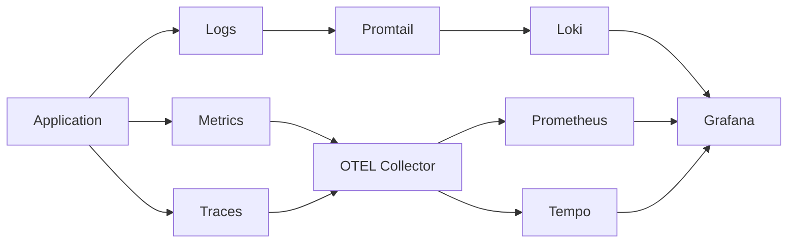
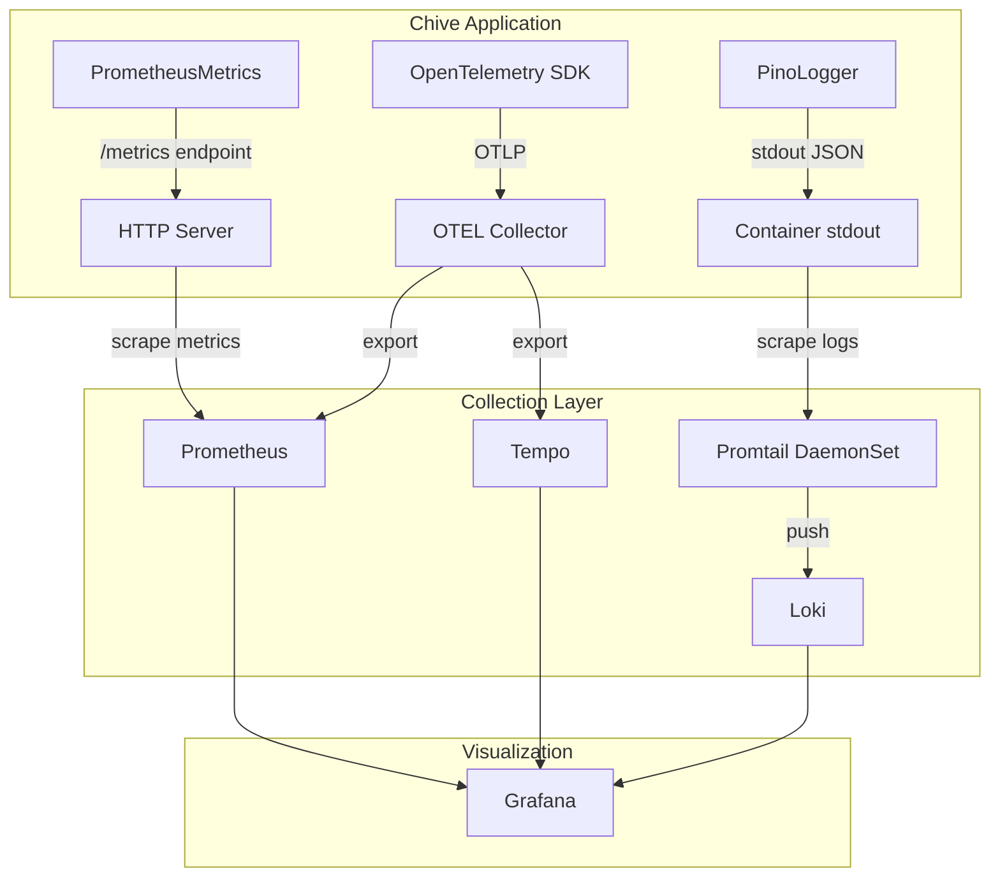

# Observability and Monitoring Developer Guide

**Version:** 1.0.0
**Phase:** 15 - Observability & Monitoring
**Last Updated:** December 2025

---

## Overview

Chive uses the three pillars of observability: logs, metrics, and traces. These tools help you understand system behavior, diagnose issues, and monitor performance.

This guide covers:

1. **Explanation**: How observability works in Chive
2. **Tutorial**: Adding observability to your service
3. **How-to guides**: Common tasks and configurations
4. **Reference**: Environment variables and defaults

---

## Understanding observability

### The three pillars



**Logs** record discrete events with context. Chive writes structured JSON logs to stdout. Promtail collects logs and sends them to Loki.

**Metrics** track numerical measurements over time. Prometheus scrapes the `/metrics` endpoint. Counters, gauges, and histograms capture request rates, queue sizes, and latencies.

**Traces** follow requests across services. OpenTelemetry sends spans to the OTEL Collector. Tempo stores traces for querying in Grafana.

### Architecture



This architecture keeps telemetry collection outside the application. Your code writes to stdout and exposes metrics. The infrastructure handles collection and storage.

### Why this approach?

**Stdout logging** is the twelve-factor app standard. It works everywhere: Docker, Kubernetes, local development. The application does not manage log files or network connections to log aggregators.

**OTEL Collector** decouples your application from backends. You can switch from Tempo to Jaeger without code changes. The collector handles batching, retries, and routing.

**Prometheus pull model** gives operators control. They configure what to scrape and how often. Applications expose metrics without knowing the collection infrastructure.

---

## Tutorial: Adding observability to your service

This tutorial shows you how to add logging, metrics, and tracing to a new service.

**Time:** 15 minutes
**Prerequisites:**

- Chive development environment set up
- Familiarity with TypeScript

### Step 1: Initialize telemetry

Call `initTelemetry()` before your application starts:

```typescript
// src/index.ts
import { initTelemetry } from '@/observability/index.js';

// Initialize telemetry before anything else
initTelemetry({
  serviceName: 'my-service',
  serviceVersion: '0.1.0',
  environment: process.env.NODE_ENV || 'development',
});

// Now start your application
import { createServer } from '@/api/server.js';
const app = createServer(/* ... */);
```

The SDK automatically instruments HTTP requests, PostgreSQL queries, and Redis operations.

### Step 2: Create a logger

Create a logger instance for your service:

```typescript
// src/services/eprint-indexer.ts
import { createLogger } from '@/observability/index.js';
import type { ILogger } from '@/types/interfaces/logger.interface.js';

export class EprintIndexer {
  private readonly logger: ILogger;

  constructor() {
    this.logger = createLogger({
      level: process.env.LOG_LEVEL || 'info',
      service: 'eprint-indexer',
    });
  }

  async indexEprint(uri: string): Promise<void> {
    this.logger.info('Indexing eprint', { uri });

    try {
      // ... indexing logic
      this.logger.info('Eprint indexed', { uri, duration: elapsed });
    } catch (error) {
      this.logger.error('Failed to index eprint', error as Error, { uri });
      throw error;
    }
  }
}
```

Logs include trace context automatically. When you view logs in Grafana, you can jump to the related trace.

### Step 3: Add metrics

Track request counts and latencies:

```typescript
// src/services/eprint-indexer.ts
import { createMetrics } from '@/observability/index.js';
import type { IMetrics } from '@/types/interfaces/metrics.interface.js';

export class EprintIndexer {
  private readonly metrics: IMetrics;

  constructor() {
    this.metrics = createMetrics({ prefix: 'chive_' });
  }

  async indexEprint(uri: string): Promise<void> {
    const endTimer = this.metrics.startTimer('eprint_indexing_duration_seconds', {
      operation: 'index',
    });

    try {
      // ... indexing logic

      this.metrics.incrementCounter('eprints_indexed_total', {
        status: 'success',
      });
    } catch (error) {
      this.metrics.incrementCounter('eprints_indexed_total', {
        status: 'error',
      });
      throw error;
    } finally {
      endTimer();
    }
  }
}
```

View your metrics at `http://localhost:3000/metrics`.

### Step 4: Add custom spans

Wrap important operations in spans:

```typescript
// src/services/eprint-indexer.ts
import { withSpan, addSpanAttributes, SpanAttributes } from '@/observability/index.js';

export class EprintIndexer {
  async indexEprint(uri: string): Promise<void> {
    return withSpan('indexEprint', async () => {
      addSpanAttributes({
        [SpanAttributes.PREPRINT_URI]: uri,
      });

      // Nested spans for sub-operations
      const metadata = await withSpan('fetchMetadata', async () => {
        return this.fetchFromPDS(uri);
      });

      await withSpan('storeInPostgres', async () => {
        return this.storage.store(metadata);
      });

      await withSpan('indexInElasticsearch', async () => {
        return this.search.index(metadata);
      });
    });
  }
}
```

Each span shows timing and can include attributes for filtering.

### Step 5: Verify it works

Start your service and make a request:

```bash
# Terminal 1: Start the service
npm run dev

# Terminal 2: Make a request
curl http://localhost:3000/api/v1/eprints

# Terminal 3: Check logs (JSON format)
# You should see structured logs with trace_id and span_id

# Terminal 4: Check metrics
curl http://localhost:3000/metrics | grep chive_
```

Expected output:

```
# HELP chive_http_requests_total Total HTTP requests
# TYPE chive_http_requests_total counter
chive_http_requests_total{method="GET",route="/api/v1/eprints",status="200"} 1
```

---

## How-to guides

### How to add a custom metric

Define metrics close to the code that uses them:

```typescript
import type { IMetrics } from '@/types/interfaces/metrics.interface.js';

export class FirehoseConsumer {
  constructor(private readonly metrics: IMetrics) {}

  processEvent(event: RepoEvent): void {
    // Counter: increment by 1
    this.metrics.incrementCounter('firehose_events_total', {
      event_type: event.type,
    });

    // Gauge: set absolute value
    this.metrics.setGauge('firehose_cursor_lag_seconds', lagSeconds, {
      relay: event.relay,
    });

    // Histogram: observe duration distribution
    this.metrics.observeHistogram('firehose_event_processing_seconds', duration, {
      event_type: event.type,
    });
  }
}
```

**Naming conventions:**

- Use snake_case
- End counters with `_total`
- End durations with `_seconds`
- Prefix with `chive_`

**Avoid high cardinality labels:**

```typescript
// Bad: user_id creates unbounded cardinality
this.metrics.incrementCounter('requests', { user_id: userId });

// Good: aggregate by user type
this.metrics.incrementCounter('requests', { user_type: 'authenticated' });
```

### How to add a custom span

Use `withSpan` for async operations:

```typescript
import { withSpan, addSpanAttributes, recordSpanError } from '@/observability/index.js';

async function processDocument(doc: Document): Promise<Result> {
  return withSpan(
    'processDocument',
    async () => {
      // Add attributes for filtering and debugging
      addSpanAttributes({
        'document.id': doc.id,
        'document.size': doc.size,
      });

      const result = await transform(doc);

      // Add result attributes
      addSpanAttributes({
        'result.status': result.status,
      });

      return result;
    },
    {
      attributes: {
        'document.type': doc.type,
      },
    }
  );
}
```

Use `withSpanSync` for synchronous operations:

```typescript
import { withSpanSync } from '@/observability/index.js';

function parseMetadata(raw: string): Metadata {
  return withSpanSync('parseMetadata', () => {
    return JSON.parse(raw);
  });
}
```

### How to configure log levels

Set the log level via environment variable:

```bash
# Options: trace, debug, info, warn, error, fatal
LOG_LEVEL=debug npm run dev
```

Or configure programmatically:

```typescript
const logger = createLogger({
  level: 'debug', // Show debug and above
  service: 'my-service',
});
```

**Log level guidelines:**

| Level   | Use for                           |
| ------- | --------------------------------- |
| `trace` | Very detailed debugging (loops)   |
| `debug` | Debugging information             |
| `info`  | Normal operations, state changes  |
| `warn`  | Unexpected but handled conditions |
| `error` | Errors that need attention        |
| `fatal` | Unrecoverable errors before exit  |

### How to create child loggers

Add context that persists across log calls:

```typescript
const requestLogger = logger.child({
  requestId: 'req_abc123',
  userId: 'did:plc:user',
});

requestLogger.info('Processing request'); // Includes requestId, userId
requestLogger.info('Fetching data'); // Includes requestId, userId
requestLogger.info('Request complete'); // Includes requestId, userId
```

### How to redact sensitive data

The logger automatically redacts these fields:

- `password`, `secret`, `token`
- `apiKey`, `api_key`
- `accessToken`, `refreshToken`
- `authorization`, `privateKey`
- `sessionToken`, `credential`

To log sensitive context safely:

```typescript
// Bad: password appears in logs
logger.info('Login attempt', { username, password });

// Good: password is redacted automatically
logger.info('Login attempt', { username, password: userInput.password });
// Output: { username: "alice", password: "[REDACTED]" }

// Better: don't log sensitive fields at all
logger.info('Login attempt', { username });
```

### How to query traces by ID

Extract trace context for cross-service correlation:

```typescript
import { getTraceContext } from '@/observability/index.js';

async function handleRequest(req: Request, res: Response): Promise<void> {
  const traceContext = getTraceContext();

  if (traceContext) {
    // Include in response headers for client debugging
    res.setHeader('X-Trace-Id', traceContext.trace_id);

    // Include in logs for correlation
    logger.info('Request handled', {
      trace_id: traceContext.trace_id,
      span_id: traceContext.span_id,
    });
  }
}
```

In Grafana, search for traces using the trace ID:

1. Open Grafana
2. Go to Explore
3. Select Tempo data source
4. Enter trace ID in search

### How to create Grafana alerts

Alert rules are defined in `k8s/monitoring/alert-rules.yaml`:

```yaml
groups:
  - name: chive-alerts
    rules:
      - alert: HighErrorRate
        expr: |
          sum(rate(chive_http_requests_total{status=~"5.."}[5m]))
          /
          sum(rate(chive_http_requests_total[5m]))
          > 0.01
        for: 5m
        labels:
          severity: critical
        annotations:
          summary: 'High error rate detected'
          description: 'Error rate is {{ $value | humanizePercentage }}'
```

Test alerts locally:

```bash
# Port-forward Prometheus
kubectl port-forward svc/prometheus 9090:9090

# View active alerts
open http://localhost:9090/alerts
```

### How to add health check dependencies

Extend the health check to include new services:

```typescript
// In your health check handler
const checks: Record<string, HealthCheckResult> = {};

// Add your service check
try {
  const start = performance.now();
  await myService.ping();
  checks.myService = {
    status: 'pass',
    latencyMs: Math.round(performance.now() - start),
  };
} catch (error) {
  checks.myService = {
    status: 'fail',
    error: error instanceof Error ? error.message : 'Unknown error',
  };
}
```

---

## Reference

### Environment variables

| Variable                      | Default                      | Description                  |
| ----------------------------- | ---------------------------- | ---------------------------- |
| `LOG_LEVEL`                   | `info`                       | Minimum log level to output  |
| `OTEL_SERVICE_NAME`           | `chive-appview`              | Service name in telemetry    |
| `OTEL_SERVICE_VERSION`        | from package.json            | Service version              |
| `OTEL_EXPORTER_OTLP_ENDPOINT` | `http://otel-collector:4318` | OTEL Collector HTTP endpoint |
| `NODE_ENV`                    | `development`                | Environment name             |

### Default metrics

The following metrics are registered automatically:

#### HTTP metrics

| Metric                                | Type      | Labels                |
| ------------------------------------- | --------- | --------------------- |
| `chive_http_requests_total`           | Counter   | method, route, status |
| `chive_http_request_duration_seconds` | Histogram | method, route         |

#### Eprint metrics

| Metric                                     | Type      | Labels        |
| ------------------------------------------ | --------- | ------------- |
| `chive_eprints_indexed_total`            | Counter   | field, status |
| `chive_eprint_indexing_duration_seconds` | Histogram | operation     |

#### Firehose metrics

| Metric                              | Type    | Labels     |
| ----------------------------------- | ------- | ---------- |
| `chive_firehose_events_total`       | Counter | event_type |
| `chive_firehose_cursor_lag_seconds` | Gauge   | relay      |
| `chive_firehose_active_connections` | Gauge   | relay      |

#### Database metrics

| Metric                            | Type      | Labels              |
| --------------------------------- | --------- | ------------------- |
| `chive_db_connections_active`     | Gauge     | database            |
| `chive_db_query_duration_seconds` | Histogram | database, operation |

### Histogram buckets

Default histogram buckets (in seconds):

```
[0.01, 0.05, 0.1, 0.5, 1, 5, 10]
```

Customize buckets when creating metrics:

```typescript
const metrics = createMetrics({
  prefix: 'chive_',
  defaultBuckets: [0.001, 0.005, 0.01, 0.05, 0.1, 0.5],
});
```

### Span attributes

Use these constants for consistent span naming:

```typescript
import { SpanAttributes } from '@/observability/index.js';

// HTTP attributes
SpanAttributes.HTTP_METHOD; // 'http.method'
SpanAttributes.HTTP_ROUTE; // 'http.route'
SpanAttributes.HTTP_STATUS_CODE; // 'http.status_code'

// Database attributes
SpanAttributes.DB_SYSTEM; // 'db.system'
SpanAttributes.DB_NAME; // 'db.name'
SpanAttributes.DB_OPERATION; // 'db.operation'

// Chive-specific attributes
SpanAttributes.PREPRINT_URI; // 'chive.eprint.uri'
SpanAttributes.USER_DID; // 'chive.user.did'
SpanAttributes.REQUEST_ID; // 'chive.request.id'
```

### Log format

Logs are JSON objects with these fields:

```json
{
  "level": 30,
  "time": 1702300800000,
  "msg": "Request completed",
  "service": "chive-appview",
  "environment": "production",
  "version": "0.1.0",
  "trace_id": "abc123def456",
  "span_id": "789ghi",
  "requestId": "req_xyz",
  "duration": 150
}
```

| Field         | Type   | Description                     |
| ------------- | ------ | ------------------------------- |
| `level`       | number | Pino log level (30=info)        |
| `time`        | number | Unix timestamp (milliseconds)   |
| `msg`         | string | Log message                     |
| `service`     | string | Service name                    |
| `environment` | string | Deployment environment          |
| `version`     | string | Service version                 |
| `trace_id`    | string | OpenTelemetry trace ID (if any) |
| `span_id`     | string | OpenTelemetry span ID (if any)  |

### Alert severity levels

| Severity   | Response time | Example                        |
| ---------- | ------------- | ------------------------------ |
| `critical` | Immediate     | Service down, data loss risk   |
| `warning`  | Within 1 hour | Degraded performance, high lag |
| `info`     | Next business | Anomalies, capacity planning   |

---

## Troubleshooting

### Traces not appearing in Tempo

1. Check that telemetry is initialized before any imports:

   ```typescript
   // This must be first
   initTelemetry({ serviceName: 'my-service' });

   // Then import application code
   import { createServer } from '@/api/server.js';
   ```

2. Verify the OTEL Collector is running:

   ```bash
   kubectl get pods -n monitoring | grep otel
   ```

3. Check collector logs for export errors:

   ```bash
   kubectl logs -n monitoring deployment/otel-collector
   ```

### Metrics missing from Prometheus

1. Check the `/metrics` endpoint returns data:

   ```bash
   curl http://localhost:3000/metrics | grep chive_
   ```

2. Verify Prometheus is scraping your service:

   ```bash
   # In Prometheus UI (Status > Targets)
   open http://localhost:9090/targets
   ```

3. Check for metric name collisions. Each metric name must be unique per type.

### Logs not appearing in Loki

1. Verify logs are going to stdout:

   ```bash
   kubectl logs deployment/chive-appview | head
   ```

2. Check Promtail is running:

   ```bash
   kubectl get pods -n monitoring | grep promtail
   ```

3. Verify Promtail labels match your Loki queries:

   ```
   {app="chive-appview"}
   ```

### High cardinality warning

If you see "Cardinality limit reached for metric":

1. Review label values. Each unique combination creates a time series.

2. Remove high-cardinality labels like user IDs or request IDs.

3. Use histograms instead of per-request metrics.

---

## Related documentation

- [API Layer Developer Guide](./api-layer.md)
- [AT Protocol Concepts](../concepts/at-protocol.md)
- [Deployment Guide](../operations/deployment.md)
