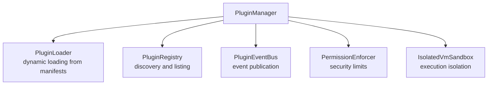
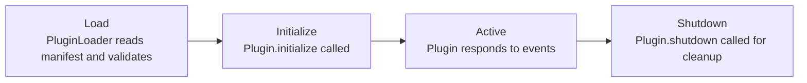

# Plugin system overview

Chive's plugin system allows external integrations for metadata enrichment, author verification, and backlink tracking. Plugins run in isolated sandboxes with declared permissions.

## Architecture

The plugin system uses a hybrid approach:

- **TSyringe** for dependency injection
- **EventEmitter2** for event hooks
- **isolated-vm** for execution isolation



## Plugin types

### Importing plugins

Import eprints from external archives:

| Plugin            | Source               | Method         |
| ----------------- | -------------------- | -------------- |
| arXiv             | arxiv.org            | OAI-PMH + API  |
| LingBuzz          | lingbuzz.net         | RSS + scraping |
| Semantics Archive | semanticsarchive.net | Web scraping   |
| PsyArXiv          | psyarxiv.com         | OSF API        |
| OpenReview        | openreview.net       | API v2         |

### Enrichment plugins

Add metadata from external sources:

| Plugin           | Data provided                             |
| ---------------- | ----------------------------------------- |
| Semantic Scholar | Citation counts, SPECTER2 recommendations |
| OpenAlex         | Concepts, institution affiliations        |
| CrossRef         | DOI metadata, references                  |
| Wikidata         | Entity linking, multilingual labels       |

### Verification plugins

Verify author identity:

| Plugin | Verification method      |
| ------ | ------------------------ |
| ORCID  | Profile works matching   |
| ROR    | Institution verification |

### Backlink plugins

Track references from ATProto apps:

| Plugin              | Source app               |
| ------------------- | ------------------------ |
| Bluesky Backlinks   | app.bsky.feed.post       |
| Semble Backlinks    | Semble notes             |
| Leaflet Backlinks   | Leaflet annotations      |
| WhiteWind Backlinks | WhiteWind research notes |

## Creating plugins

See [Creating plugins](./creating-plugins.md) for a step-by-step guide.

### Plugin manifest

Every plugin declares its metadata and permissions:

```json
{
  "id": "pub.chive.plugin.example",
  "name": "Example Plugin",
  "version": "1.0.0",
  "description": "What this plugin does",
  "author": "Your Name",
  "license": "MIT",
  "entrypoint": "dist/index.js",
  "permissions": {
    "network": {
      "allowedDomains": ["api.example.com"]
    },
    "storage": {
      "maxSize": "50MB"
    },
    "hooks": ["eprint.indexed"]
  }
}
```

### Base classes

Plugins extend one of three base classes:

```typescript
// General purpose plugin
class MyPlugin extends BasePlugin {
  async onEprintIndexed(eprint: Eprint): Promise<void> {
    // React to new eprints
  }
}

// Import external eprints
class MyImporter extends ImportingPlugin {
  async fetchEprints(): AsyncIterable<ImportedEprint> {
    // Yield eprints from external source
  }
}

// Track ATProto backlinks
class MyBacklinkTracker extends BacklinkTrackingPlugin {
  readonly collection = 'com.example.post';

  async extractBacklinks(record: unknown): Promise<Backlink[]> {
    // Extract Chive references from records
  }
}
```

## Plugin lifecycle



### Initialization

Plugins receive a context with dependencies:

```typescript
async initialize(context: PluginContext): Promise<void> {
  this.logger = context.logger;
  this.cache = context.cache;
  this.http = context.httpClient;
  this.eventBus = context.eventBus;
}
```

### Event hooks

Plugins subscribe to lifecycle events:

```typescript
this.eventBus.on('eprint.indexed', async (event) => {
  await this.enrichEprint(event.eprint);
});

this.eventBus.on('system.shutdown', async () => {
  await this.flushCache();
});
```

## Security model

### Permission enforcement

Plugins declare required permissions in their manifest. The system blocks unauthorized operations:

```typescript
// Allowed: Domain in manifest
await this.http.get('https://api.example.com/data');

// Blocked: Domain not in manifest
await this.http.get('https://other-site.com/data');
// Throws: PermissionDeniedError
```

### Resource limits

| Resource        | Default limit            |
| --------------- | ------------------------ |
| Network domains | 20 max                   |
| Storage         | 100 MB max               |
| Event hooks     | 50 max                   |
| Execution time  | 30 seconds per operation |

### Isolation

Plugins run in isolated-vm sandboxes:

- No access to Node.js internals
- No file system access
- No process spawning
- Memory limits enforced

## Configuration

Plugin behavior can be configured via environment variables:

| Variable                 | Default     | Description                |
| ------------------------ | ----------- | -------------------------- |
| `PLUGIN_DIR`             | `./plugins` | Plugin directory           |
| `PLUGIN_CACHE_TTL`       | `86400`     | Cache TTL in seconds       |
| `PLUGIN_MAX_CONCURRENCY` | `5`         | Parallel plugin operations |

## Next steps

- [Creating plugins](./creating-plugins.md): Build your own plugin
- [Builtin plugins](./builtin-plugins.md): Reference for included plugins
