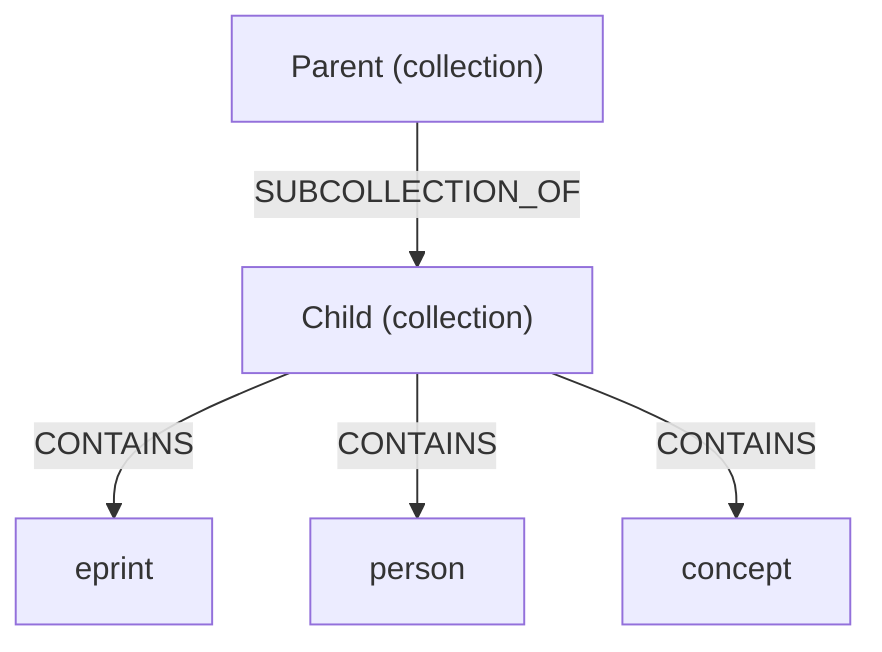
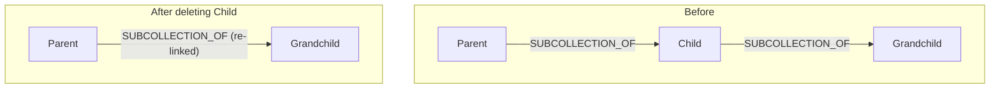

# CollectionService

CollectionService indexes and queries user-curated collections. Collections are personal graph nodes (subkind=collection) linked to items via CONTAINS edges and organized hierarchically via SUBCOLLECTION_OF edges. The service handles indexing from the firehose, cascade deletion, cycle detection, activity feeds, and visibility-gated queries.

## Data model

Three concepts form the collection system:

- **Collection**: A personal graph node with `kind='object'`, `subkind='collection'`. Stores a label, optional description, visibility (`listed` or `unlisted`), and optional tags.
- **CONTAINS edge**: Links a collection to an item. The item is another personal graph node (subkind varies: `eprint`, `person`, `review`, `endorsement`, `concept`, `reference`).
- **SUBCOLLECTION_OF edge**: Links a child collection to its parent, forming a tree hierarchy. Cycle detection prevents circular references.



Items are always personal graph nodes, not raw eprints or graph nodes directly. The frontend creates a personal node wrapper (via `useCreatePersonalNode`) before adding it to a collection.

## Service interface

Key methods on `CollectionService` (from `src/services/collection/collection-service.ts`):

```typescript
class CollectionService {
  // Indexing (firehose)
  indexCollection(
    nodeRecord: unknown,
    metadata: RecordMetadata
  ): Promise<Result<void, DatabaseError | ValidationError>>;
  indexCollectionEdge(
    edgeRecord: unknown,
    metadata: RecordMetadata
  ): Promise<Result<void, DatabaseError | ValidationError>>;
  updateCollection(
    uri: AtUri,
    nodeRecord: unknown,
    metadata: RecordMetadata
  ): Promise<Result<void, DatabaseError | ValidationError>>;
  deleteCollection(uri: AtUri): Promise<Result<void, DatabaseError>>;
  deleteCollectionEdge(edgeUri: AtUri): Promise<Result<void, DatabaseError>>;

  // Queries
  getCollection(uri: AtUri, authDid?: DID): Promise<IndexedCollection | null>;
  getCollectionItems(
    uri: AtUri,
    options?: { excludeSubcollectionItems?: boolean }
  ): Promise<Result<CollectionItem[], DatabaseError>>;
  listByOwner(did: DID, options?: PaginationOptions): Promise<PaginatedResult<IndexedCollection>>;
  listPublic(
    options?: PaginationOptions & { tag?: string }
  ): Promise<PaginatedResult<IndexedCollection>>;
  searchCollections(
    query: string,
    options?: PaginationOptions & { visibility?: string; ownerDid?: DID }
  ): Promise<PaginatedResult<IndexedCollection>>;
  getCollectionsContaining(itemUri: AtUri, authDid?: DID): Promise<IndexedCollection[]>;
  getSubcollections(collectionUri: AtUri, authDid?: DID): Promise<IndexedCollection[]>;
  getParentCollection(collectionUri: AtUri, authDid?: DID): Promise<IndexedCollection | null>;
  findContainsEdge(
    collectionUri: AtUri,
    itemUri: string
  ): Promise<{
    edgeUri: string;
    parentCollectionUri?: string;
    cosmikItems?: Record<string, unknown>;
  } | null>;
  getInterItemEdges(collectionUri: AtUri): Promise<InterItemEdge[]>;
  getCollectionFeed(
    collectionUri: AtUri,
    options?: { limit?: number; cursor?: string }
  ): Promise<Result<CollectionFeedResult, DatabaseError>>;
  getProfileConfig(did: DID): Promise<ProfileConfig | null>;
}
```

### Visibility filtering

Most query methods accept an optional `authDid` parameter. Unlisted collections are excluded from public listings and search but accessible by direct URI. The SQL filter for listing endpoints is:

```sql
WHERE c.visibility = 'listed'
```

For direct access endpoints (e.g., `getCollection`), unlisted collections are visible to anyone with the URI:

```sql
WHERE (c.visibility = 'listed' OR c.owner_did = $authDid OR c.uri = $requestedUri)
```

### The `excludeSubcollectionItems` option

When `getCollectionItems` is called with `excludeSubcollectionItems: true`, items that also appear in a subcollection are excluded from the parent's item list. This prevents duplicate display in hierarchical views.

## XRPC endpoints

| NSID                                     | Type  | Description                                                     |
| ---------------------------------------- | ----- | --------------------------------------------------------------- |
| `pub.chive.collection.get`               | Query | Get collection with items, subcollections, and inter-item edges |
| `pub.chive.collection.listByOwner`       | Query | List a user's collections                                       |
| `pub.chive.collection.listPublic`        | Query | Browse public collections across all users                      |
| `pub.chive.collection.search`            | Query | Search collections by label and description                     |
| `pub.chive.collection.getContaining`     | Query | Find collections that contain a given item                      |
| `pub.chive.collection.getParent`         | Query | Get the parent collection in the hierarchy                      |
| `pub.chive.collection.getSubcollections` | Query | Get child subcollections                                        |
| `pub.chive.collection.getFeed`           | Query | Activity feed for a collection's items                          |
| `pub.chive.collection.findContainsEdge`  | Query | Look up the CONTAINS edge between a collection and an item      |

All endpoints are registered in `src/api/handlers/xrpc/collection/index.ts` via the `collectionMethods` map. Authentication is optional on all collection endpoints; unauthenticated requests see only public collections.

### `findContainsEdge` detail

This endpoint returns:

| Field                 | Type    | Description                                                   |
| --------------------- | ------- | ------------------------------------------------------------- |
| `found`               | boolean | Whether the CONTAINS edge exists                              |
| `edgeUri`             | string  | AT-URI of the edge (when found)                               |
| `parentCollectionUri` | string  | AT-URI of the parent collection, for walking up the hierarchy |
| `cosmikCardUri`       | string  | AT-URI of the Cosmik card for this item                       |
| `cosmikLinkUri`       | string  | AT-URI of the Cosmik collection link                          |
| `cosmikItemUrl`       | string  | URL key in the cosmikItems metadata map                       |

The `parentCollectionUri` field enables the frontend to walk up the collection tree during delete propagation without additional round-trips.

## Delete propagation

When a user removes an item from a subcollection, the frontend propagates the deletion up the collection hierarchy. The mechanism works as follows:

1. User removes item from the current collection (deletes the CONTAINS edge in their PDS).
2. Frontend calls `findContainsEdge` on the parent collection to locate the CONTAINS edge linking the same item.
3. If `found` is true, the frontend deletes that parent's CONTAINS edge from the user's PDS.
4. The response includes `parentCollectionUri`, so the frontend repeats the lookup on the next ancestor.
5. The loop continues until `parentCollectionUri` is absent (root collection reached) or the edge is not found.
6. If any step fails, the frontend logs a warning and stops. Propagation is best-effort.

Simplified code flow from `use-collections.ts`:

```typescript
// inside useRemoveFromCollection mutation
let parentUri = parentCollectionUri;

while (parentUri) {
  const result = await api.get('/xrpc/pub.chive.collection.findContainsEdge', {
    params: { query: { collectionUri: parentUri, itemUri } },
  });

  if (!result.data?.found || !result.data.edgeUri) break;

  // delete the CONTAINS edge from user's PDS
  await agent.com.atproto.repo.deleteRecord({
    repo: did,
    collection: 'pub.chive.graph.edge',
    rkey: extractRkey(result.data.edgeUri),
  });

  parentUri = result.data.parentCollectionUri;
}
```

## Frontend hooks

Hooks are defined in `web/lib/hooks/use-collections.ts`. All use TanStack Query for caching and mutation management.

### Query hooks

| Hook                                | Purpose                                                 |
| ----------------------------------- | ------------------------------------------------------- |
| `useMyCollections(did)`             | Fetch all collections owned by a user                   |
| `useCollection(uri, options?)`      | Fetch a single collection with items and subcollections |
| `useCollectionsContaining(itemUri)` | Find which collections contain a given item             |
| `usePublicCollections(options?)`    | Browse public collections with optional tag filter      |
| `useSearchCollections(query)`       | Search collections by text                              |
| `useSubcollections(uri)`            | Fetch child subcollections of a collection              |
| `useParentCollection(uri)`          | Fetch the parent collection                             |
| `useCollectionFeed(uri, options?)`  | Paginated activity feed (infinite query)                |

### Mutation hooks

| Hook                        | Purpose                                             |
| --------------------------- | --------------------------------------------------- |
| `useCreateCollection()`     | Create a new collection node in user's PDS          |
| `useUpdateCollection()`     | Update collection label, description, or visibility |
| `useDeleteCollection()`     | Delete collection and clean up edges                |
| `useAddToCollection()`      | Create a CONTAINS edge in user's PDS                |
| `useRemoveFromCollection()` | Delete a CONTAINS edge with parent propagation      |
| `useReorderItems()`         | Update item order via edge weights                  |
| `useUpdateItemNote()`       | Update the note on a CONTAINS edge                  |
| `useUpdateCollectionItem()` | Update a personal graph node within a collection    |
| `useAddSubcollection()`     | Create a SUBCOLLECTION_OF edge                      |
| `useRemoveSubcollection()`  | Delete a SUBCOLLECTION_OF edge                      |
| `useMoveSubcollection()`    | Re-parent a subcollection                           |

## Add-to-collection flow

The `useAddItemToCollection` hook (in `web/components/collection/use-add-to-collection.ts`) orchestrates the full add flow:

1. **Map item type to personal node subkind.** The `buildPersonalNodeInput` function maps: `eprint` to `'eprint'`, `author` to `'person'`, `review` to `'review'`, `endorsement` to `'endorsement'`, `graphNode` to `'concept'`. All other types default to `'reference'`.

2. **Create a personal graph node in the user's PDS.** Calls `useCreatePersonalNode` to create a `pub.chive.graph.node` record wrapping the original item. The node stores the item URI in its metadata (e.g., `{ eprintUri: "at://..." }`).

3. **Create a CONTAINS edge.** Calls `useAddToCollection` to create a `pub.chive.graph.edge` record with `relationSlug: 'contains'`, linking the collection to the personal node.

4. **Walk the parent chain.** If `allCollections` is provided, the hook iterates up the `parentCollectionUri` chain and adds the same personal node to each ancestor collection. Parent propagation failures are logged as warnings but do not block the operation.

## Database tables

| Table                        | Purpose                                                                  |
| ---------------------------- | ------------------------------------------------------------------------ |
| `collections_index`          | Collection metadata (label, description, visibility, tags, timestamps)   |
| `collection_edges_index`     | CONTAINS and SUBCOLLECTION_OF edges between collections and items        |
| `personal_graph_nodes_index` | Personal graph nodes that serve as collection items and collection nodes |
| `personal_graph_edges_index` | Personal graph edges; used for inter-item edges within collections       |

The `_index` suffix on all table names indicates these are index tables per ATProto compliance: they store indexed copies of records whose source of truth is in user PDSes.

### Key columns on `collections_index`

| Column        | Type      | Description                        |
| ------------- | --------- | ---------------------------------- |
| `uri`         | TEXT (PK) | AT-URI of the collection node      |
| `cid`         | TEXT      | Content hash for verification      |
| `owner_did`   | TEXT      | DID of the collection owner        |
| `label`       | TEXT      | Display name                       |
| `description` | TEXT      | Optional description               |
| `visibility`  | TEXT      | `'listed'` or `'unlisted'`         |
| `tags`        | JSONB     | Array of string tags               |
| `pds_url`     | TEXT      | Source PDS for staleness detection |

### Key columns on `collection_edges_index`

| Column          | Type      | Description                                                       |
| --------------- | --------- | ----------------------------------------------------------------- |
| `uri`           | TEXT (PK) | AT-URI of the edge record                                         |
| `source_uri`    | TEXT      | Collection URI (for CONTAINS) or child URI (for SUBCOLLECTION_OF) |
| `target_uri`    | TEXT      | Item URI (for CONTAINS) or parent URI (for SUBCOLLECTION_OF)      |
| `relation_slug` | TEXT      | `'contains'` or `'subcollection-of'`                              |
| `weight`        | REAL      | Sort order (lower = earlier)                                      |
| `label`         | TEXT      | Optional edge label                                               |

## Cascade deletion

When a collection is deleted, the service applies the following cascade rules in a single transaction:

1. **SUBCOLLECTION_OF is transitive.** If the deleted collection has both a parent and children, the children's SUBCOLLECTION_OF edges are re-pointed to the parent. If there is no parent, the children become root collections (their SUBCOLLECTION_OF edges are deleted).

2. **CONTAINS is NOT transitive.** Items directly in the deleted collection are removed; their CONTAINS edges are deleted. Items are not promoted to the parent collection.



Items in the deleted collection are removed, not moved to the parent.

Cycle detection uses a recursive CTE to walk the ancestor chain before allowing new SUBCOLLECTION_OF edges. Self-loops are rejected immediately.

## Collection feed

The `getCollectionFeed` method generates an activity feed for a collection by joining collection items against activity tables. Feed event types depend on the item subkind:

| Item subkind  | Feed event types                                                                             |
| ------------- | -------------------------------------------------------------------------------------------- |
| `eprint`      | `review_on_eprint`, `endorsement_on_eprint`, `annotation_on_eprint`                          |
| `person`      | `eprint_by_author`, `review_by_author`, `endorsement_by_author`, `eprint_referencing_person` |
| `field`       | `eprint_in_field`                                                                            |
| `institution` | `eprint_by_institution`                                                                      |
| `event`       | `eprint_at_event`                                                                            |

Events are deduplicated by `(type, event_uri)` and sorted by `event_at DESC`. Pagination uses compound cursors in the format `{ISO-8601}::{eventUri}`.

## ATProto compliance

- Collections, edges, and personal nodes are PDS records owned by users. Chive indexes them from the firehose.
- Chive never writes to user PDSes. All mutations (create, update, delete) happen in the user's PDS via the ATProto agent in the frontend.
- All index tables use the `_index` suffix and track `pds_url` for staleness detection.
- Indexes are fully rebuildable from the firehose at any time.
- Visibility filtering is applied server-side; unlisted collections are excluded from listings and search but accessible by direct URI.

## Related documentation

- [User guide: Collections](../../user-guide/collections.md)
- [PostgreSQL storage](../storage/postgresql.md)
- [Knowledge graph concepts](../../concepts/knowledge-graph.md)
- [Indexing service](./indexing.md)
- [PDS discovery](./pds-discovery.md)
