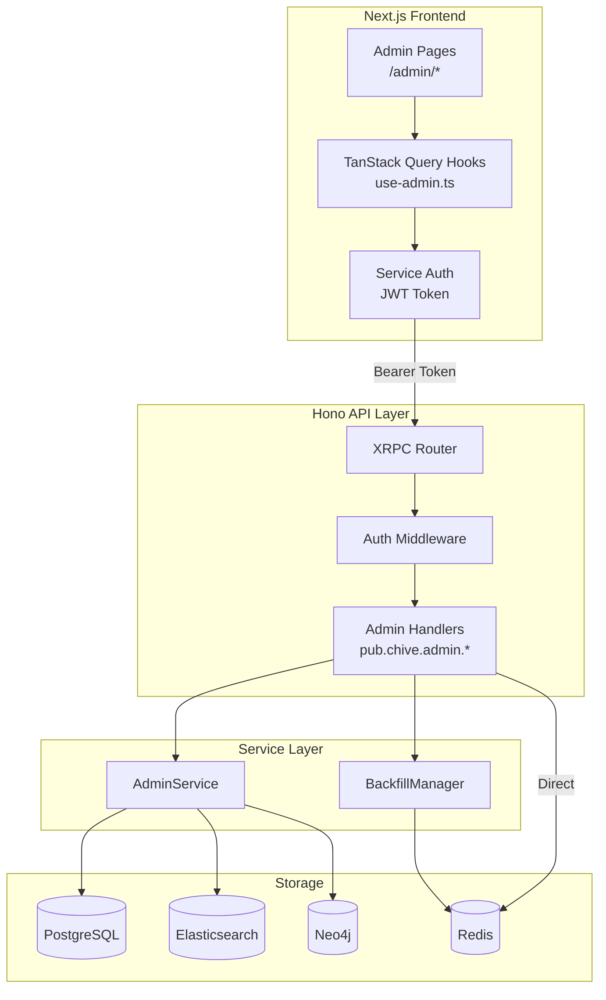

# Admin dashboard architecture

This document covers the technical architecture of the admin dashboard, including the backend service layer, state management, XRPC handler pattern, and frontend design.

## Architecture overview



## AdminService

The `AdminService` class (`src/services/admin/admin-service.ts`) provides all read operations for the admin dashboard. It queries local indexes; it never writes to user PDSes.

### Constructor dependencies

| Dependency | Type                          | Purpose                                       |
| ---------- | ----------------------------- | --------------------------------------------- |
| `pgPool`   | `Pool` (pg)                   | PostgreSQL connection pool for index queries  |
| `redis`    | `Redis` (ioredis)             | Role lookups, firehose cursor, DLQ operations |
| `esPool`   | `ElasticsearchConnectionPool` | Search analytics, full-text queries           |
| `neo4j`    | `Neo4jConnection`             | Knowledge graph statistics                    |
| `logger`   | `ILogger`                     | Structured logging                            |

### Method organization

Methods are grouped by domain:

| Domain    | Methods                                                                                          |
| --------- | ------------------------------------------------------------------------------------------------ |
| Overview  | `getOverview()`, `getSystemHealth()`                                                             |
| Alpha     | `getAlphaApplications()`, `getAlphaApplication()`, `updateAlphaApplication()`, `getAlphaStats()` |
| Users     | `searchUsers()`, `getUserDetail()`                                                               |
| Content   | `listEprints()`, `listReviews()`, `listEndorsements()`, `deleteContent()`                        |
| PDS       | `listPDSEntries()`, `listImports()`                                                              |
| Graph     | `getPendingProposalCount()`                                                                      |
| Analytics | `getSearchAnalytics()`, `getViewDownloadTimeSeries()`                                            |
| Audit     | `getAuditLog()`, `listWarnings()`, `listViolations()`                                            |

All methods return plain data objects (no Result monads). Errors propagate as exceptions to the XRPC handler layer.

### Database health checks

The `getSystemHealth()` method pings each database in parallel:

- **PostgreSQL**: `SELECT 1`
- **Elasticsearch**: cluster health API
- **Neo4j**: `RETURN 1` via session
- **Redis**: `PING` command

Each check has a timeout. If any check fails, the database is marked `unhealthy` with the error message. The overall status is:

- `healthy` if all databases are healthy
- `degraded` if some (but not all) are unhealthy
- `unhealthy` if all databases are unhealthy

## BackfillManager

The `BackfillManager` class (`src/services/admin/backfill-manager.ts`) manages long-running backfill operations with Redis-backed state tracking.

### Redis state management

Each operation is stored as a JSON blob in Redis:

- **Key**: `chive:admin:backfill:{uuid}`
- **TTL**: 24 hours (operations automatically expire)
- **Set key**: `chive:admin:backfill:operations` tracks all known operation IDs

The `BackfillOperation` record contains:

```typescript
interface BackfillOperation {
  id: string; // UUID
  type: BackfillOperationType; // pdsScan, freshnessScan, etc.
  status: BackfillStatus; // running, completed, failed, cancelled
  startedAt: string; // ISO 8601
  completedAt?: string; // ISO 8601
  progress?: number; // 0-100
  recordsProcessed?: number;
  error?: string;
  metadata?: Record<string, unknown>;
}
```

### AbortController pattern

Each running operation gets an `AbortController`:

1. `startOperation()` creates the controller and stores it in an in-memory `Map<string, AbortController>`
2. The handler receives the `AbortSignal` via the return value
3. Background work checks `signal.aborted` periodically
4. `cancelOperation()` calls `controller.abort()` and updates the Redis status to `cancelled`
5. On completion or failure, the controller is removed from the map

Note: `AbortController` instances are in-memory. If the server restarts, running operations cannot be cancelled (they are orphaned in Redis as `running` until the 24-hour TTL expires).

### Prometheus instrumentation

The BackfillManager instruments three metrics:

- `chive_backfill_operations_total`: incremented on start, completion, failure, and cancellation
- `chive_backfill_records_processed`: incremented on completion with the final record count
- `chive_backfill_duration_seconds`: histogram timer started on `startOperation()`, stopped on completion/failure/cancellation

## XRPC handler pattern

Every admin handler follows the same structure:

```typescript
export const someHandler: XRPCMethod<ParamsType, InputType, OutputType> = {
  type: 'procedure', // only for mutations; omit for queries
  auth: true,
  handler: async ({ params, input, c }) => {
    // 1. Check admin role
    const user = c.get('user');
    if (!user?.isAdmin) {
      throw new AuthorizationError('Admin access required', 'admin');
    }

    // 2. Resolve service dependency
    const admin = c.get('services').admin;
    if (!admin) {
      throw new ServiceUnavailableError('Admin service is not configured');
    }

    // 3. Validate input (for procedures)
    if (!input?.requiredField) {
      throw new ValidationError('Field is required', 'field', 'required');
    }

    // 4. Delegate to service
    const result = await admin.someMethod(input.requiredField);

    // 5. Increment metrics (for mutations)
    adminMetrics.actionsTotal.inc({ action: 'some_action', target: 'some_target' });

    // 6. Return response
    return { encoding: 'application/json', body: result };
  },
};
```

Key points:

- **Queries** use `params` (query string parameters)
- **Procedures** use `input` (request body, parsed as JSON)
- Services are resolved from the Hono context via `c.get('services')`
- The `user` object is set by auth middleware and includes `did`, `isAdmin`, and role flags

### Backfill trigger handlers

Backfill triggers follow an additional pattern: they start the operation via `BackfillManager`, then run the actual work in a fire-and-forget `void (async () => { ... })()` block. The handler returns immediately with the operation ID.

## Frontend architecture

### Hooks pattern

All admin data fetching is centralized in `web/lib/hooks/use-admin.ts`. This file exports TanStack Query hooks for every admin endpoint.

**Fetch helpers:**

- `adminFetch<T>(nsid, params?)`: authenticated GET request to an admin XRPC endpoint
- `adminProcedure<T>(nsid, input?)`: authenticated POST request to an admin XRPC endpoint

Both helpers resolve the service auth JWT from the current OAuth agent session.

**Query hooks** (data fetching):

| Hook                            | NSID                                    | Refetch interval |
| ------------------------------- | --------------------------------------- | ---------------- |
| `useAdminOverview()`            | `pub.chive.admin.getOverview`           | 30s              |
| `useSystemHealth()`             | `pub.chive.admin.getSystemHealth`       | 30s              |
| `useFirehoseStatus()`           | `pub.chive.admin.getFirehoseStatus`     | 10s              |
| `useBackfillStatus()`           | `pub.chive.admin.getBackfillStatus`     | 5s               |
| `useAlphaApplications(status?)` | `pub.chive.admin.listAlphaApplications` | none             |
| `useAlphaStats()`               | `pub.chive.admin.getAlphaStats`         | none             |
| `useSearchUsers(query)`         | `pub.chive.admin.searchUsers`           | none             |
| `useGraphStats()`               | `pub.chive.admin.getGraphStats`         | 60s              |
| `useEndpointMetrics()`          | `pub.chive.admin.getEndpointMetrics`    | 30s              |
| `useNodeMetrics()`              | `pub.chive.admin.getNodeMetrics`        | 15s              |
| (and more)                      |                                         |                  |

**Mutation hooks** (actions):

| Hook                          | NSID                                     | Invalidates      |
| ----------------------------- | ---------------------------------------- | ---------------- |
| `useUpdateAlphaApplication()` | `pub.chive.admin.updateAlphaApplication` | alpha queries    |
| `useAssignRole()`             | `pub.chive.admin.assignRole`             | user queries     |
| `useRevokeRole()`             | `pub.chive.admin.revokeRole`             | user queries     |
| `useDeleteContent()`          | `pub.chive.admin.deleteContent`          | content queries  |
| `useTriggerBackfill(type)`    | `pub.chive.admin.trigger*`               | backfill queries |
| `useCancelBackfill()`         | `pub.chive.admin.cancelBackfill`         | backfill queries |
| `useRetryDLQEntry()`          | `pub.chive.admin.retryDLQEntry`          | DLQ queries      |
| `useRetryAllDLQ()`            | `pub.chive.admin.retryAllDLQ`            | DLQ queries      |

Mutations use `useMutation` with `onSuccess` callbacks that call `queryClient.invalidateQueries()` to refresh related data.

### AdminGuard component

The `AdminGuard` component (`web/components/auth/admin-guard.tsx`) protects admin routes:

1. Renders a loading skeleton while the user's role is being resolved
2. If the user is authenticated but not an admin, redirects to `/dashboard`
3. If the user is an admin, renders the children

It is nested inside `AuthGuard` (which handles the authentication check) in the admin layout:

```tsx
<AuthGuard>
  <AdminGuard>
    <SidebarLayout sidebar={<AdminNav />}>{children}</SidebarLayout>
  </AdminGuard>
</AuthGuard>
```

### Role checking

The frontend determines admin status through the auth context:

1. On login, the app calls `pub.chive.actor.getMyRoles`
2. The response includes `isAdmin`, `isAlphaTester`, `isPremium` boolean flags
3. These are stored in the auth context and available via `useAuth()`
4. The `AdminGuard` component reads `user.isAdmin` from this context

## Adding a new admin endpoint

To add a new admin XRPC endpoint:

### 1. Add the handler

Create `src/api/handlers/xrpc/admin/myNewHandler.ts`:

```typescript
import { AuthorizationError, ServiceUnavailableError } from '../../../../types/errors.js';
import type { XRPCMethod, XRPCResponse } from '../../../xrpc/types.js';

interface MyNewParams {
  readonly someParam?: string;
}

export const myNewHandler: XRPCMethod<MyNewParams, void, unknown> = {
  auth: true,
  handler: async ({ params, c }): Promise<XRPCResponse<unknown>> => {
    const user = c.get('user');
    if (!user?.isAdmin) {
      throw new AuthorizationError('Admin access required', 'admin');
    }

    const admin = c.get('services').admin;
    if (!admin) {
      throw new ServiceUnavailableError('Admin service is not configured');
    }

    const result = await admin.myNewMethod(params.someParam);

    return { encoding: 'application/json', body: result };
  },
};
```

### 2. Register the handler

In `src/api/handlers/xrpc/admin/index.ts`, add the import and register the NSID:

```typescript
import { myNewHandler } from './myNewHandler.js';

export const adminMethods = {
  // ... existing methods ...
  'pub.chive.admin.myNewEndpoint': myNewHandler,
};
```

### 3. Add the service method

In `src/services/admin/admin-service.ts`, add the method that the handler calls.

### 4. Add the frontend hook

In `web/lib/hooks/use-admin.ts`, add a query or mutation hook:

```typescript
export function useMyNewData(someParam?: string) {
  return useQuery({
    queryKey: ['admin', 'myNewData', someParam],
    queryFn: () =>
      adminFetch<MyNewResponse>('pub.chive.admin.myNewEndpoint', {
        ...(someParam ? { someParam } : {}),
      }),
  });
}
```

### 5. Add the page

Create `web/app/admin/my-new-page/page.tsx` and add it to the navigation in `web/app/admin/layout.tsx`.

## Related documentation

- [Admin Dashboard](../operations/admin-dashboard.md): user-facing dashboard guide
- [Admin API Reference](../api-reference/admin-endpoints.md): all admin XRPC endpoints
- [Roles & Access Control](../operations/roles-and-access.md): role system details
