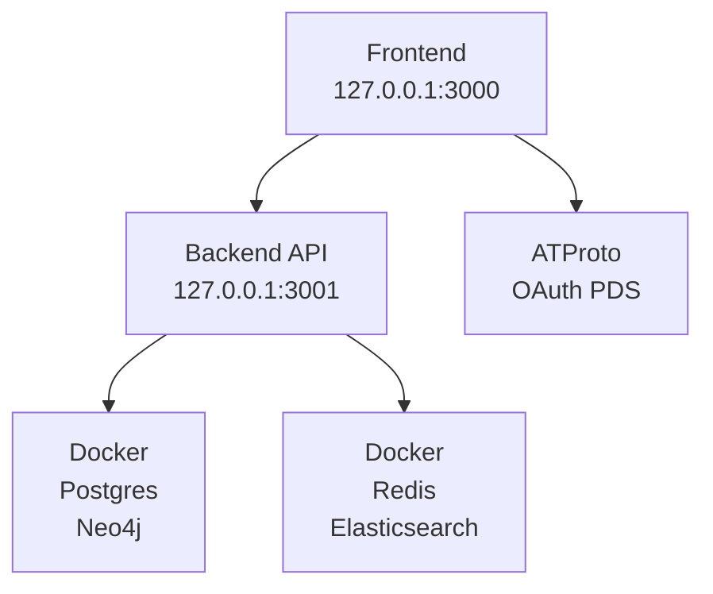

# Local development setup

Quick start guide for running Chive locally with full OAuth support.

## Prerequisites

- **Node.js** 22+ or Bun
- **pnpm** 9+
- **Docker Desktop** (for databases)
- **ngrok** or **localtunnel** (optional, for OAuth testing)

## First-time setup

Before running for the first time:

```bash
# 1. Install dependencies
pnpm install

# 2. Copy environment file (default values work for local dev)
cp .env.example .env

# 3. Ensure Docker Desktop is running
open -a "Docker Desktop"  # macOS
```

That's it! The dev script handles everything else (databases, environment generation).

## Quick start

### Loopback mode (default)

For UI development and API testing without real OAuth:

```bash
pnpm dev
```

This starts:

- Frontend at `http://127.0.0.1:3000`
- Backend at `http://127.0.0.1:3001`
- PostgreSQL, Redis, Elasticsearch, Neo4j via Docker

### Tunnel mode (OAuth testing)

For testing OAuth with a real Bluesky account:

```bash
pnpm dev:tunnel
```

Requires ngrok or localtunnel installed. See [Tunnel Setup](#tunnel-setup).

## Development modes

### Loopback mode

| Component | URL                     | Notes                               |
| --------- | ----------------------- | ----------------------------------- |
| Frontend  | `http://127.0.0.1:3000` | Next.js dev server                  |
| Backend   | `http://127.0.0.1:3001` | Hono API with hot reload            |
| OAuth     | ATProto loopback client | Limited session, no persistent auth |

**Use for**: UI development, API testing, component work.

### Tunnel mode

| Component | URL                            | Notes                             |
| --------- | ------------------------------ | --------------------------------- |
| Frontend  | `https://<subdomain>.ngrok.io` | Public tunnel URL                 |
| Backend   | `http://127.0.0.1:3001`        | Local API (proxied via Next.js)   |
| OAuth     | Full ATProto OAuth             | Persistent sessions with real PDS |

**Use for**: Testing OAuth flows, integration testing with Bluesky.

## Available scripts

| Command             | Description                                 |
| ------------------- | ------------------------------------------- |
| `pnpm dev`          | Start full dev environment (loopback mode)  |
| `pnpm dev:local`    | Alias for `pnpm dev`                        |
| `pnpm dev:tunnel`   | Start with tunnel for OAuth testing         |
| `pnpm dev:db`       | Start databases only                        |
| `pnpm dev:api`      | Start API server only (with hot reload)     |
| `pnpm dev:stop`     | Stop dev servers (keeps databases running)  |
| `pnpm dev:stop:all` | Stop everything including Docker containers |

## Tunnel setup

### Option 1: ngrok (recommended)

1. Install ngrok:

   ```bash
   brew install ngrok  # macOS
   # or download from https://ngrok.com/download
   ```

2. Authenticate (one-time):

   ```bash
   ngrok config add-authtoken <your-token>
   ```

3. Run tunnel mode:
   ```bash
   pnpm dev:tunnel
   ```

### Option 2: localtunnel

No installation required (uses npx):

```bash
pnpm dev:tunnel
```

The script auto-detects available tunnel tools.

## Environment variables

### Auto-generated (web/.env.local)

The dev scripts automatically generate this file:

```bash
NEXT_PUBLIC_OAUTH_BASE_URL=http://127.0.0.1:3000  # or tunnel URL
NEXT_PUBLIC_API_URL=http://127.0.0.1:3001
NEXT_PUBLIC_DEV_MODE=local  # or "tunnel"
```

### Backend (.env)

Copy from `.env.example`:

```bash
cp .env.example .env
```

Default values work for local development.

## Troubleshooting

### OAuth "Invalid loopback client ID" error

**Cause**: ATProto requires `http://127.0.0.1:<port>` (not `http://localhost`).

**Fix**: Ensure `NEXT_PUBLIC_OAUTH_BASE_URL` uses `127.0.0.1`, not `localhost`.

### CORS errors

**Cause**: Origin mismatch between frontend and backend.

**Fix**:

1. Verify frontend runs on `http://127.0.0.1:3000`
2. Check `CORS_ORIGINS` in backend includes frontend origin
3. For tunnel mode, ensure tunnel URL is in CORS_ORIGINS

### Databases not starting

**Cause**: Docker Desktop not running or port conflicts.

**Fix**:

1. Start Docker Desktop
2. Check for port conflicts: `lsof -i :5432 -i :6379 -i :9200 -i :7474`
3. Stop conflicting services or change ports in docker-compose

### Hot reload not working

**Backend**: Ensure running via `pnpm dev:api` (uses tsx watch)
**Frontend**: Ensure running via `pnpm dev` in web/ directory

## Stopping the environment

### Quick stop (keep databases)

Stop dev servers but keep Docker databases running for faster restart:

```bash
pnpm dev:stop
```

### Full stop (everything)

Stop all processes including Docker containers:

```bash
pnpm dev:stop:all
```

### Manual stop

If scripts aren't working, you can stop processes manually:

```bash
# Stop Node.js processes
pkill -f "next dev"
pkill -f "tsx.*watch"

# Stop ngrok
pkill -f ngrok

# Stop Docker containers
cd docker && docker compose -f docker-compose.local.yml down
```

## Architecture



## Security notes

- Development secrets contain `-not-for-production` suffix
- Production validates secrets don't contain this suffix
- Never commit `.env.local` or `scripts/ngrok.yml`
- Tunnel URLs are temporary and should not be shared

## Next steps

- [Configuration reference](../reference/configuration): configuration file reference
- [Environment variables](../reference/environment-variables): env var reference
- [Deployment](../operations/deployment): production setup
