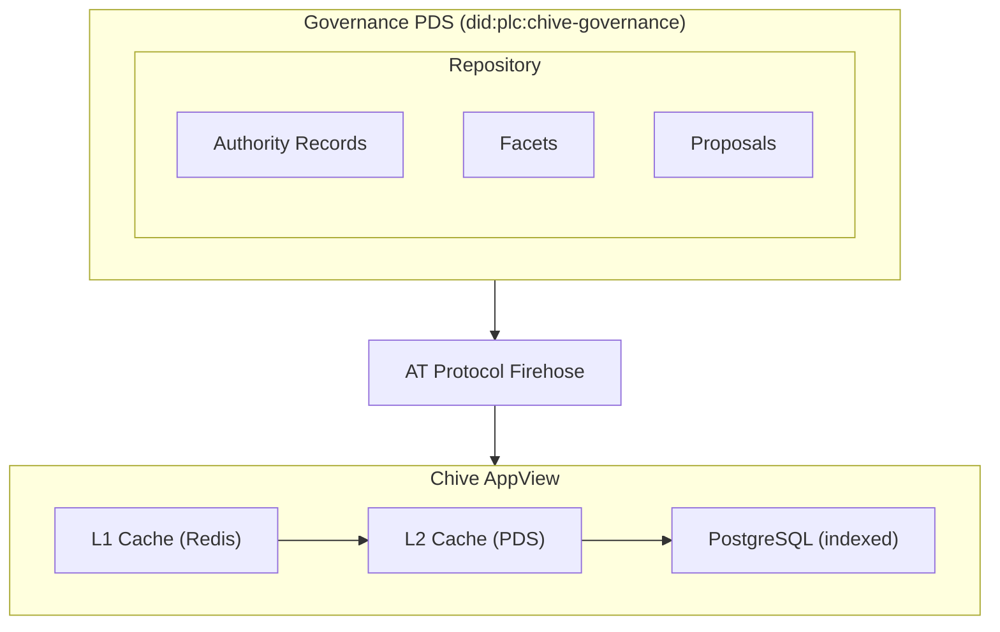
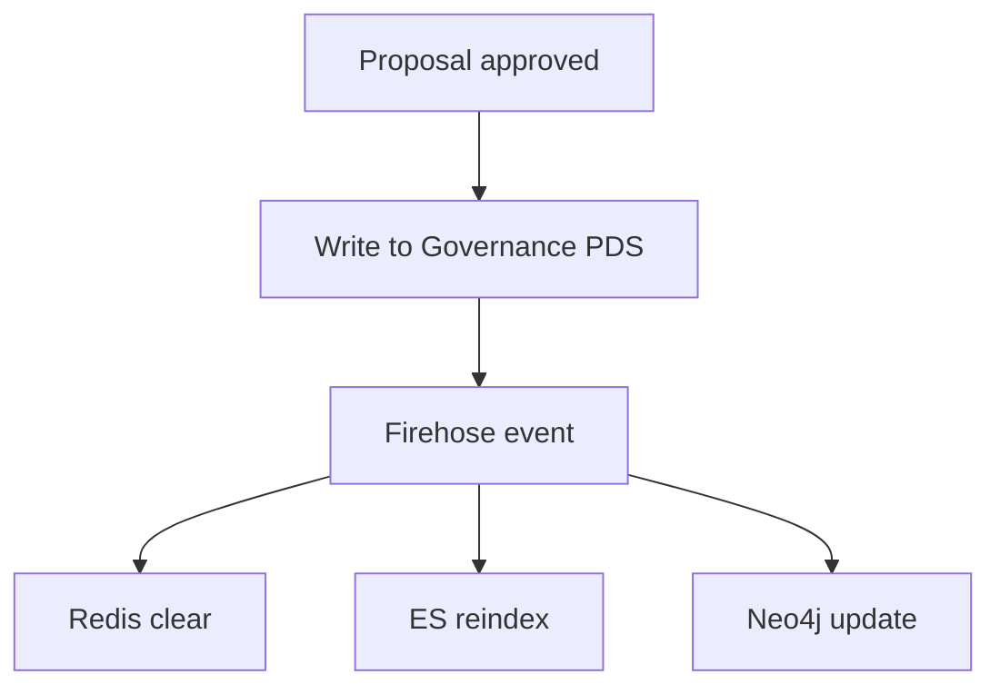

# Governance PDS

The Governance PDS is a dedicated Personal Data Server that stores all community-approved governance data. This makes Chive's governance ATProto-native and portable.

## Overview

```
did:plc:chive-governance
```

The Governance PDS stores:

- Authority records
- Facet definitions
- Field taxonomy
- Organizational records
- Approved proposals
- Reconciliation history

## Why a Governance PDS?

### ATProto-native benefits

| Benefit              | Description                                 |
| -------------------- | ------------------------------------------- |
| **Portability**      | Governance data can move to different hosts |
| **Verifiability**    | All records are cryptographically signed    |
| **Interoperability** | Any ATProto AppView can index the data      |
| **Transparency**     | Public, auditable record of decisions       |

### Comparison with traditional approaches

| Approach      | Governance PDS     | Central database        |
| ------------- | ------------------ | ----------------------- |
| Data location | Decentralized PDS  | Chive servers only      |
| Ownership     | Community          | Platform                |
| Portability   | Full export/import | Requires migration      |
| Verification  | Cryptographic      | Trust-based             |
| Failover      | Any compliant host | Single point of failure |

## Record types

### Graph nodes

Knowledge graph nodes stored in the Governance PDS:

```typescript
// Collection: pub.chive.graph.node
interface GraphNodeDocument {
  $type: 'pub.chive.graph.node';
  id: string;
  kind: 'type' | 'object';
  subkind: string; // 'field', 'facet', 'institution', 'person', 'concept'
  label: string;
  alternateLabels: string[];
  description: string;
  externalIds: ExternalId[];
  status: 'proposed' | 'provisional' | 'established' | 'deprecated';
  createdAt: string;
  updatedAt: string;
}

interface ExternalId {
  source: string; // 'wikidata', 'lcsh', 'viaf', 'fast', 'orcid', 'ror'
  value: string;
}
```

### Graph edges

Relationships between nodes are stored as separate edge records:

```typescript
// Collection: pub.chive.graph.edge
interface GraphEdgeDocument {
  $type: 'pub.chive.graph.edge';
  sourceUri: string;
  targetUri: string;
  relationSlug: 'broader' | 'narrower' | 'related' | 'sameAs';
  weight: number;
  status: 'proposed' | 'established' | 'deprecated';
  createdAt: string;
}
```

### Approved proposals

```typescript
// Collection: pub.chive.governance.approvedProposal
interface ApprovedProposalDocument {
  $type: 'pub.chive.governance.approvedProposal';
  id: string;
  originalProposalUri: string;
  type: ProposalType;
  title: string;
  changes: ProposalChanges;
  votingSummary: VotingSummary;
  approvedAt: string;
  enactedAt: string;
}
```

### Reconciliation records

```typescript
// Collection: pub.chive.governance.reconciliation
interface ReconciliationDocument {
  $type: 'pub.chive.governance.reconciliation';
  authorityId: string;
  externalSource: string;
  externalId: string;
  confidence: number;
  evidenceType: string;
  reconciler: string; // DID of person/automated
  timestamp: string;
}
```

## Architecture



## Cache strategy

### Multi-level caching

| Level | Storage        | TTL                | Purpose                  |
| ----- | -------------- | ------------------ | ------------------------ |
| L1    | Redis          | 5 minutes          | Hot data, low latency    |
| L2    | Governance PDS | Authoritative      | Source of truth fallback |
| L3    | PostgreSQL     | Until invalidation | Indexed for queries      |

### Cache invalidation

When governance data changes:



## Security

### Access control

| Operation    | Who can perform              |
| ------------ | ---------------------------- |
| Read records | Anyone                       |
| Create node  | Graph editors                |
| Update node  | Graph editors (via proposal) |
| Create edge  | Graph editors                |
| Update edge  | Graph editors (via proposal) |
| Sign records | Authorized administrators    |

### Audit trail

All changes include provenance:

```json
{
  "record": { ... },
  "sig": "z...",
  "provenance": {
    "proposal": "at://did:plc:.../pub.chive.graph.proposal/abc",
    "approvedAt": "2025-01-15T10:30:00Z",
    "approvedBy": "did:plc:admin..."
  }
}
```

## Operations

### Backup and recovery

```bash
# Export full repository
atproto repo export did:plc:chive-governance --output backup.car

# Verify integrity
atproto repo verify backup.car

# Restore to new PDS (if needed)
atproto repo import backup.car --target new-pds.example.com
```

### Monitoring

Metrics tracked:

- Record count by type
- Write latency
- Firehose lag
- Cache hit rates
- Sync status with AppView

### Failover

If the Governance PDS becomes unavailable:

1. AppView continues operating from cached data
2. Write operations queued
3. Failover PDS activated from most recent backup
4. DNS updated to point to failover
5. Queued writes replayed

## Migration path

### Current state (pre-2026)

Authority records stored in PostgreSQL with Governance PDS as secondary.

### Target state (2026+)

Governance PDS becomes authoritative source:

```
Phase 1 (Q1 2026): Dual-write to both PG and PDS
Phase 2 (Q2 2026): PDS becomes primary, PG becomes cache
Phase 3 (Q3 2026): Remove PG dependency for governance data
```

## API access

### Read from Governance PDS

```http
GET https://pds.chive.pub/xrpc/com.atproto.repo.listRecords?
  repo=did:plc:chive-governance&
  collection=pub.chive.governance.authorityRecord&
  limit=50
```

### Through Chive AppView (recommended)

```http
GET /xrpc/pub.chive.graph.getAuthority?id=authority-123
```

The AppView provides:

- Faster response (cached)
- Additional computed fields
- Cross-references resolved
- Search capability

## Next steps

- [Authority control](./authority-control.md): Managing authority records
- [Governance overview](./overview.md): The governance model
- [AT Protocol](/concepts/at-protocol): Understanding PDSes
