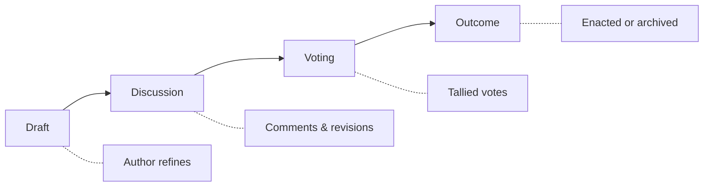

# Proposals

Proposals are the primary mechanism for changing the knowledge graph, authority records, and governance policies. This document covers proposal types, the submission process, and lifecycle.

## Proposal types

### Node proposals

Changes to knowledge graph nodes (fields, facets, authorities). All node types use `pub.chive.graph.nodeProposal`:

| Type          | Description                                     | Threshold     |
| ------------- | ----------------------------------------------- | ------------- |
| **Create**    | Add a new node to the knowledge graph           | 67%, 5+ votes |
| **Update**    | Modify node label, description, or external IDs | 60%, 3+ votes |
| **Merge**     | Combine two or more nodes into one              | 67%, 5+ votes |
| **Deprecate** | Mark a node as obsolete                         | 75%, 7+ votes |

The `kind` and `subkind` fields determine what type of node is being proposed:

| subkind       | Description                   | Examples                         |
| ------------- | ----------------------------- | -------------------------------- |
| `field`       | Academic discipline or topic  | "Machine Learning", "Physics"    |
| `facet`       | PMEST classification value    | "Arctic", "Holocene"             |
| `institution` | Research organization         | "MIT CSAIL", "CERN"              |
| `person`      | Individual (authority record) | Named researcher entries         |
| `concept`     | General concept               | "Reproducibility", "Open Access" |

### Edge proposals

Changes to relationships between nodes. Uses `pub.chive.graph.edgeProposal`:

| Type          | Description                          | Threshold     |
| ------------- | ------------------------------------ | ------------- |
| **Create**    | Add a new relationship between nodes | 60%, 3+ votes |
| **Update**    | Modify edge weight or relation type  | 60%, 3+ votes |
| **Deprecate** | Remove a relationship                | 67%, 5+ votes |

Edge relation types:

| Relation   | Description                                |
| ---------- | ------------------------------------------ |
| `broader`  | Hierarchical parent (used for "parent of") |
| `narrower` | Hierarchical child (used for "child of")   |
| `related`  | Associative relationship                   |
| `sameAs`   | Equivalence mapping to external entity     |

### Tag promotion

Elevating user tags to authority terms:

| Phase                    | Description                               |
| ------------------------ | ----------------------------------------- |
| **Automatic nomination** | Tag used by 3+ users on 10+ eprints       |
| **Community vote**       | Standard proposal process (60%, 3+ votes) |

## Creating a proposal

### Required fields

```typescript
interface Proposal {
  type: ProposalType;
  title: string; // Concise summary (max 100 chars)
  description: string; // Detailed rationale (500-2000 words)
  changes: ProposalChanges; // Specific modifications
  evidence?: Evidence[]; // Supporting materials
  relatedProposals?: string[]; // Links to related proposals
}
```

### Node proposal example

```json
{
  "$type": "pub.chive.graph.nodeProposal",
  "proposalType": "create",
  "kind": "object",
  "subkind": "field",
  "proposedNode": {
    "id": "cs.QML",
    "label": "Quantum Machine Learning",
    "alternateLabels": ["QML"],
    "description": "Algorithms and theory combining quantum computing with machine learning techniques",
    "externalIds": [{ "source": "wikidata", "value": "Q96207645" }]
  },
  "rationale": "Quantum Machine Learning (QML) is an emerging interdisciplinary field at the intersection of quantum computing and machine learning. The field has grown significantly since 2018, with dedicated conferences (QML Workshop at NeurIPS, QTML) and journals (Quantum Machine Intelligence).",
  "evidence": [
    {
      "type": "publication_count",
      "source": "OpenAlex",
      "value": 4523,
      "url": "https://openalex.org/concepts/C2778047726"
    },
    {
      "type": "conference",
      "source": "QTML",
      "url": "https://qtml2024.org"
    }
  ],
  "createdAt": "2025-01-15T10:30:00Z"
}
```

To establish parent-child relationships, submit separate edge proposals:

```json
{
  "$type": "pub.chive.graph.edgeProposal",
  "proposalType": "create",
  "proposedEdge": {
    "sourceUri": "at://did:plc:chive-governance/pub.chive.graph.node/cs.QML",
    "targetUri": "at://did:plc:chive-governance/pub.chive.graph.node/cs.QC",
    "relationSlug": "broader",
    "weight": 1.0
  },
  "rationale": "QML is a subfield of Quantum Computing",
  "createdAt": "2025-01-15T10:30:00Z"
}
```

## Proposal lifecycle



### Phase 1: Draft

**Duration**: Unlimited (until submitted)

- Author creates and refines proposal
- Can save drafts before submission
- Not visible to community

### Phase 2: Discussion

**Duration**: 7 days (14 for controversial)

Activities:

- Community members comment
- Author can revise proposal
- Related discussions linked
- Expert opinions solicited

Revisions during discussion:

- Minor edits allowed anytime
- Major changes restart discussion period
- Changes logged in revision history

### Phase 3: Voting

**Duration**: 5 days (plus extensions if needed)

- No further changes to proposal
- Votes cast by eligible users
- Real-time tally displayed
- Quorum monitored

### Phase 4: Outcome

| Result        | Criteria                        | Next steps            |
| ------------- | ------------------------------- | --------------------- |
| **Approved**  | Threshold met, quorum met       | Changes enacted       |
| **Rejected**  | Threshold not met               | Archived for 6 months |
| **Expired**   | Quorum not met after extensions | Can resubmit          |
| **Withdrawn** | Author withdrawal               | Archived immediately  |

## After approval

When a proposal is approved:

1. **Governance PDS update**: Changes written to the Governance PDS
2. **Cache invalidation**: Redis cache cleared for affected records
3. **Search reindex**: Elasticsearch updated with new classifications
4. **Graph update**: Neo4j updated with new nodes/relationships
5. **Notification**: Affected users notified

Timeline:

- Most changes: Within 1 hour
- Authority record changes: Within 24 hours (manual review)
- Major taxonomy changes: Within 7 days (staged rollout)

## Best practices

### Writing effective proposals

1. **Be specific**: Clearly state what changes and why
2. **Provide evidence**: Link to publications, conferences, or databases
3. **Address objections**: Anticipate concerns in the description
4. **Scope appropriately**: One logical change per proposal
5. **Use plain language**: Avoid jargon; explain technical terms

### During discussion

- Respond promptly to questions
- Incorporate constructive feedback
- Thank contributors for engagement
- Avoid arguing; let votes decide

### Common rejection reasons

| Reason                          | How to avoid                                                 |
| ------------------------------- | ------------------------------------------------------------ |
| Insufficient evidence           | Provide publication counts, conferences, expert endorsements |
| Overlap with existing fields    | Search thoroughly before proposing                           |
| Too broad/narrow                | Consult similar fields for appropriate scope                 |
| Poor description                | Have someone else review before submitting                   |
| Controversial without consensus | Build support during discussion phase                        |

## Special proposal types

### Batch proposals

For related changes that should be decided together:

```json
{
  "type": "batch",
  "title": "Reorganize Computational Biology subfields",
  "proposals": [
    { "type": "create_field", ... },
    { "type": "update_field", ... },
    { "type": "merge_fields", ... }
  ],
  "rationale": "These changes are interdependent and should be evaluated as a whole"
}
```

Batch proposals:

- Voted on as a single unit
- Use highest threshold among component proposals
- All succeed or all fail

### Amendment proposals

To modify an in-progress proposal:

```json
{
  "type": "amendment",
  "targetProposal": "proposal-123",
  "changes": {
    "field.description": "Updated description text..."
  }
}
```

Amendments:

- Only during discussion phase
- Require original author approval or 60% vote
- Reset discussion period if substantial

## Proposal API

### Create proposal

```http
POST /xrpc/pub.chive.governance.createProposal

{
  "type": "create_field",
  "title": "...",
  "description": "...",
  "changes": { ... }
}
```

### List proposals

```http
GET /xrpc/pub.chive.governance.listProposals?status=voting&type=field
```

### Get proposal

```http
GET /xrpc/pub.chive.governance.getProposal?id=proposal-123
```

### Cast vote

```http
POST /xrpc/pub.chive.governance.castVote

{
  "proposalId": "proposal-123",
  "vote": "approve",
  "comment": "Well-researched proposal with clear evidence."
}
```

## Next steps

- [Voting system](./voting-system.md): How votes are weighted and tallied
- [Authority control](./authority-control.md): Special rules for authority records
- [Governance overview](./overview.md): The governance model
