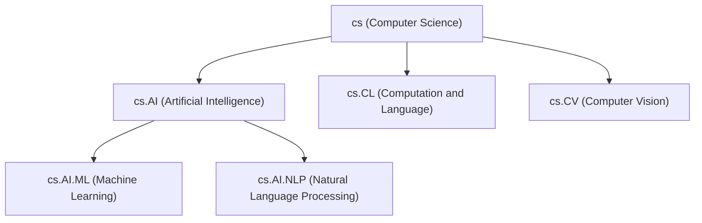

# Tags and classification

Chive uses a combination of hierarchical fields and user-contributed tags to organize eprints. This guide explains how to tag papers and navigate the classification system.

## Fields vs tags

Chive has two classification systems:

| System     | Who controls it             | Purpose                             |
| ---------- | --------------------------- | ----------------------------------- |
| **Fields** | Community-governed taxonomy | Primary hierarchical classification |
| **Tags**   | Individual users            | Flexible, emergent folksonomy       |

### Fields

Fields form a hierarchical taxonomy similar to arXiv categories:



Authors assign fields when submitting. Community proposals can add new fields or reorganize the hierarchy.

### Tags

Tags are free-form labels anyone can add:

- `attention-mechanisms`
- `transformer-architecture`
- `benchmark-dataset`
- `reproducibility-study`

Tags help with discovery beyond the formal taxonomy.

## Adding tags

### To your own papers

1. Go to your eprint's page
2. Click **Add Tags**
3. Type a tag name
4. Select from suggestions or create a new tag
5. Click **Save**

### To any paper

If you've read a paper and want to help classify it:

1. Click **Add Tags** on the paper's page
2. Your contributed tags appear with your name
3. Popular tags get promoted; rarely-used tags fade

## Tag guidelines

### Good tags

- Specific methodologies: `monte-carlo-simulation`, `transformer-xl`
- Datasets: `imagenet`, `squad-2.0`
- Applications: `drug-discovery`, `climate-modeling`
- Paper types: `survey-paper`, `negative-results`, `reproducibility`

### Avoid

- Too broad: `science`, `research`, `paper`
- Duplicating fields: Don't tag `machine-learning` if the field is already cs.AI.ML
- Personal notes: `to-read`, `interesting`, `read-later`
- Promotional: `groundbreaking`, `must-read`

## Tag moderation

### Spam detection

Chive automatically filters:

- Promotional or marketing tags
- Offensive content
- Tags unrelated to the paper's content
- Bulk tagging by bots

### Community curation

- Tags with many contributors rise in visibility
- Rarely-used tags are de-emphasized
- Trusted editors can remove inappropriate tags
- Disputed tags can be flagged for review

## PMEST classification

Behind the scenes, Chive maps papers to the PMEST framework:

| Dimension       | What it captures | Examples                                       |
| --------------- | ---------------- | ---------------------------------------------- |
| **Personality** | Who              | Authors, institutions, funders                 |
| **Matter**      | What             | Subject field, methodology                     |
| **Energy**      | How              | Research type (theoretical, empirical, review) |
| **Space**       | Where            | Geographic focus, language                     |
| **Time**        | When             | Publication date, historical period studied    |

PMEST enables faceted search: "Show me empirical AI papers from European institutions published in 2024."

## Proposing new fields

If the taxonomy lacks a field for your research area:

1. Go to **Governance** → **Proposals**
2. Click **Propose New Node**
3. Select `field` as the node subkind
4. Fill out the form:
   - Proposed field ID (e.g., `cs.QML`)
   - Label (e.g., "Quantum Machine Learning")
   - Alternate labels (synonyms like "QML")
   - Description and scope
   - Justification
5. Optionally propose edge relationships to parent fields
6. Submit for community voting

### Voting requirements

| Proposal type | Approval threshold | Minimum votes                 |
| ------------- | ------------------ | ----------------------------- |
| New field     | 67%                | 5 votes, 3 from field experts |
| Update field  | 60%                | 3 votes                       |
| Merge fields  | 67%                | 5 votes                       |

## Trending tags

View which tags are gaining popularity:

1. Go to **Trending** in the navigation
2. Select a time window: 24 hours, 7 days, or 30 days
3. See tags ranked by recent usage growth

### How trending is calculated

Tags are scored based on:

- **Recent usage count**: Number of times the tag was applied in the time window
- **Quality score**: Considers uniqueness and relevance
- **Growth rate**: Comparison to previous period

### API access

```http
GET /xrpc/pub.chive.tag.getTrending?timeWindow=7d&limit=20
```

Time windows: `24h`, `7d`, `30d`

## Searching by classification

### Field browsing

1. Go to **Browse** → **Fields**
2. Navigate the hierarchy
3. Click a field to see all papers

### Tag search

1. Click any tag on a paper
2. Or search: `tag:transformer-architecture`
3. Combine with other filters: `tag:reproducibility field:cs.AI`

### Faceted filtering

Use the sidebar filters:

- **Field**: Select from hierarchy
- **Tags**: Multi-select popular tags
- **Research Type**: Theoretical, empirical, review, etc.
- **Date Range**: Filter by publication date

## Related topics

- [Searching](./searching.md): Full search guide
- [Governance](../governance/overview.md): How proposals work
- [Knowledge Graph](../concepts/knowledge-graph.md): Technical details
